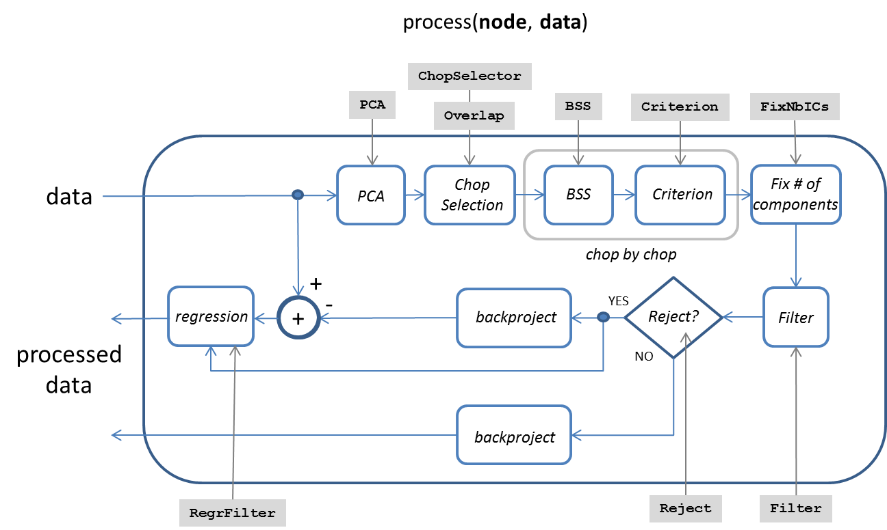

`bss_regr` node
====

The `bss_regr` node can be used to (1) decompose a physioset into a set of 
spatio-temporal components, and (2) filter a physioset by rejecting or 
accepting a subset of such components. 

## Usage synopsis

````matlab
import meegpipe.*;
obj = node.bss_regr.new('key', value, ...);
data = run(obj, data);
````

where `data` is a [physioset][physioset] object.

[physioset]: https://github.com/germangh/matlab_physioset/blob/master/%2Bphysioset/%40physioset/README.md


## Construction arguments

Several construction arguments can be provided as key/value pairs. Namely,
the `bss_regr` node admits all the key/value pairs admitted by the
[abstract_node][abstract-node] class constructor. These construction keys
are common to all [node][node] classes and we usually refer to them as
_node properties_.

Additionally, the constructor of the `bss_regr` node also accepts a set of
keys that are specific to the `bss_regr` node (i.e. not shared by other 
`node` classes). Such keys are usually refered to as 
_configuration options_. See the documentation of the helper 
[config][config] class for a list of all available configuration options 
for `bss_regr` nodes.

[abstract-node]: ../@abstract_node/README.md
[config]: ./config.md
[node]: ../README.md


## Methods

See the documentation of the [node API documentation][node].

[node]: ../README.md


## Implementation details

The basic operation of the generic node method `run()` is described in the 
documentation of the [node API][node-ifc]. Such `run()` method relies on 
method `process()` which is specific to each concrete class of processing 
nodes (i.e. specific to a each child class of `abstract_node`). The 
operation of method `process()` for nodes of class `bss_regr` is 
summarized in the diagram below. Node _configuration options_ appear in 
gray-filled boxes, and their interactions with the various processing 
steps are illustrated with gray arrows. A detailed explanation of the 
purpose of each _configuration option_ can be found in the documentation of
the helper [config][config] class.



In a few words, `bss_regr`'s method `process()` performs the following 
operations:

1. The input data is projected into its principal components. The exact 
definition of this step is provided with the configuration option `PCA`.

2. The input data is divided into a series of correlative analysis windows
or _data chops_.

3. Each analysis window is fed to a Blind Source Separation algorithm 
(whose definition is provided by configuration option `BSS`), and sources 
of interest are identified using an automatic criterion (defined by the
value of the `Criterion` configuration option).

4. Since a criterion may select different number of sources across different
analysis windows, configuration option `FixNbICs` can be used to enforce 
that the same number of sources is selected across all windows. 

5. The selected sources in each window are filtered (or not, depending 
on whether configuration option `Filter` is provided or left empty).

6. The selected sources are backprojected and the result is either removed
from the original data (if `Reject` is true), or it is used as the node
output. If `Reject` is true, then there is the possibility of additionally 
regressing out the sources time-series (if a suitable regression filter 
is provided using option `RegrFilter`).


## Pre-defined `bss_regr` nodes

You may create a new `bss_regr` node by specifying all the relevant 
node properties manually (see the help of the associated [config][config] 
class for a list of all available options). However, you may also consider
using one of the pre-defined `bss_regr` configurations. Below you will 
find a list of such pre-defined configuration with various target
applications:

### `ecg`

This configuration may be used to reject cardiac-related components. See 
below for a usage example:

````matlab
import meegpipe.node.*;
myNode = bss_regr.ecg;
run(myNode, data)
````

where `data` is a `physioset` object. 

The `ecg` configuration uses [multicombi][multicombi] to estimate the set 
of spatio-temporal components, and a criterion based on the detection of 
QRS complexes to identify components of cardiac origin.

[multicombi]: http://si.utia.cas.cz/downloadPT.htm

### `emg`

This configuration may be used to reject muscle-related components. 

__Note:__ This configuration has not been properly tested yet. 

### `eog`

This configuration aims to remove ocular components. See below a usage 
example:

````matlab
import meegpipe.node.*;
myNode = bss_regr.eog;
run(myNode, data)
````

where `data` is a `physioset` object. 

The `eog` configuration uses [jade][jade] to decompose the input data into
a set of spatio-temporal components. It then uses a combination of various 
topographical and temporal criteria to identify components that are likely 
to be of ocular origin. 

[jade]: http://bsp.teithe.gr/members/downloads/Jade.html

### `eog_ec`

This configuration is very similar to `eog` but it specifically aims the
removal of ocular components from EEG data that was acquired with the 
subjects having the eyes closed. Configuration `eog` exploits the fact that
blinks are typically easy to identify, and uses such blinks to determine 
the topographical characteristics of a prototypical ocular component. 
However, `blinks` are not present in an eyes-closed condition and that is
why the `eog` configuration is not likely to work well in such cases.

### `pwl`

This configuration aims to remove powerline (50 Hz) noise components. 


## Usage examples

The example below assume that _meegpipe_ has been initialized using:

````matlab
clear all;
meegpipe.initialize;
````


### Reject independent components of ocular origin

For this tasks we will use one of the pre-defined `bss_regr` 
configurations, namely the `eog` configuration. Such configuration admits 
an argument called `Correction`, which takes values in the 0 to 100 range, 
and that determines how harsh the correction will be. The larger 
`Correction` the more stringent the correction. So we define our EOG 
correction node as follows:


````matlab
import meegpipe.node.*;
% Assume data sampling rate is 1000 Hz
myNode = bss_regr.eog(1000, 'Correction', 50);
````


### Select a single alpha-related component

Since we want to select alpha components, we want the PCA step to
focus its learning process on the low frequencies. We can do this by 
building a custom PCA block with a suitable value for the `Filter` property:

````matlab
% Assume 1000 Hz sampling rate, filter cutoff is 40 Hz
myFilter = filter.lpfilt('fc', 40/500);
myPCA = spt.pca.pca('Var', .99, 'Filter', myFilter);
````

All implemented BSS algorithms also support the `Filter` property, so you
could also enforce that the BSS learning process uses only the 
lowpass-filtered version of the data. 

Since we want to select one alpha component, we will build a component 
selection criterion that selects components with a large ratio of power 
in the alpha band versus power in a lower band. Many alternative 
criteria are possible for selecting an alpha-like component. Our 
criterion is defined as follows:

````matlab
myCrit = spt.criterion.psd_ratio.new(...
    'Band1', [8 11],  ...
    'Band2', [4 8], ...
    'MinCard', 1, ...
    'MaxCard', 1);
````

Properties `MinCard` and `MaxCard` can be used to specify the minimum 
(resp. maximum) number of components that will be selected. By setting 
both to 1 we ensure that exactly one component will be selected.

Since we are looking at the alpha rhythm, it is obvious that our node 
should only process EEG (or MEG) data. It should not try to find an alpha 
component in the (possibly many) additional data modalities that your 
physiological dataset may contain. Moreover, we want our node to ignore 
any bad data samples or bad data channels in our data (e.g. when learning 
the PCA or BSS basis). To enforce these requirements we need to 
define a suitable [data selector][selector]:

[selector]: https://github.com/germangh/matlab_pset/tree/master/+pset/+selector

````matlab
% This first selector will select only good data
mySel1 = pset.selector.good_data;
% This second selector will select only EEG or MEG data
mySel2 = pset.selector.sensor_class('Class', {'EEG', 'MEG'});
````

Since all data procesing nodes accept a single data selector, we need to 
combine the two selectors above into one:

````matlab
% Will apply mySel2 on the selection produced by mySel1
mySel = pset.selector.cascade(mySel1, mySel2);
````

Now we have all the necessary components to build a `bss_regr` node
that will do the job:

````matlab
import meegpipe.node.*;
myNode = bss_regr.new(...
    'Criterion',     myCrit, ...
    'PCA',           myPCA, ...
    'DataSelector',  mySel, ...
    'Reject',        false);
````

Note that we set `Reject` to false because our node is supposed to 
_select_ a single alpha component, rather than _reject_ that component.