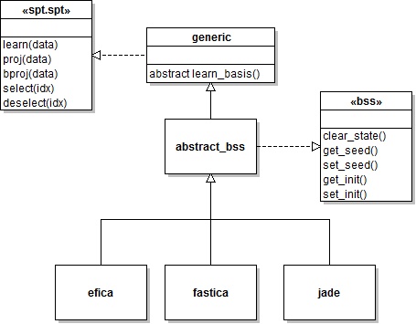

`spt.bss` package
====

The `spt.bss` package contains classes that implement various [Blind Source
Separation][wiki-bss]. All such classes inherit from the [abstract_bss][absbss]
class and thus they all share the methods defined by `abstract_bss` and its
parent classes.

The hierarchical organization of the BSS classes included in this package is
illustrated in the class diagram below:

[absbss]: ./abstract_bss.md

## Usage synopsis

    % Build a sample dataset
    myData = pset.pset.rand(3,1000);

    % Learn JADE basis and project data onto them
    myAlg = spt.bss.jade.new();
    myAlg = learn(myAlg, myData);
    ics = proj(myAlg, myData);

    % Get also the projection matrix
    mat = projmat(myAlg);

    % Reject the third component and back-project
    deselect(myAlg, 3);
    filtData = bproj(myAlg, ics);

## Available BSS algorithms

Each available BSS algorithm is implemented as a sub-package within the
`spt.bss` package. See below a list of the available algorithms:

Package                         | Algorithm
-----------                     | ------------
[spt.bss.amica][amica-pkg]      | Palmer Jason's [AMICA][amica] algorithm
[spt.bss.atdsep][atdsep-pkg]    | Adaptive version of the [TDSEP][tdsep] algorithm. This is __experimental__!.
[spt.bss.efica][efica-pkg]      | [EFICA][efica] algorithm by P. Tichavsky and K. Koldovsky
[spt.bss.ewasobi][ewasobi-pkg]  | [EWASOBI][ewasobi] algorithm, as implemented by [P. Tichavsky][tichavsky]
[spt.bss.fastica][fastica-pkg]  | The well-known [FastICA][fastica] algorithm, by [A. Hyvärinen][hyvarinen]
[spt.bss.jade][jade-pkg]        | The [JADE][jade] algorithm by J. F. Cardoso
[spt.bss.multicombi][mcombi-pkg]| The [MULTICOMBI][mcombi] algorithm by P. Tichavsky and others.
[spt.bss.runica][runica-pkg]    | The [Infomax][imax] implementation included in [EEGLAB][eeglab]
[spt.bss.tdsep][tdsep-pkg]      | Own implementation of the [TDSEP][tdsep] algorithm

[amica-pkg]: ./+amica/README.md
[atdsep-pkg]: ./+atdsep/README.md
[efica-pkg]: ./+efica/README.md
[ewasobi-pkg]: ./+ewasobi/README.md
[fastica-pkg]: ./+fastica/README.md
[jade-pkg]: ./+jade/README.md
[mcombi-pkg]: ./+multicombi/README.md
[runica-pkg]: ./+runica/README.md
[tdsep-pkg]: ./+tdsep/README.md

[amica]: http://sccn.ucsd.edu/~jason/
[tdsep]: http://citeseerx.ist.psu.edu/viewdoc/summary?doi=10.1.1.33.3067
[efica]: http://itakura.ite.tul.cz/zbynek/efica.htm
[ewasobi]: http://si.utia.cas.cz/downloadPT.htm
[tichavsky]: http://si.utia.cas.cz/Tichavsky.html
[fastica]: http://research.ics.aalto.fi/ica/fastica/
[jade]: http://perso.telecom-paristech.fr/~cardoso/guidesepsou.html
[mcombi]: http://si.utia.cas.cz/downloadPT.htm
[imax]: http://sccn.ucsd.edu/eeglab/allfunctions/runica.html
[eeglab]: http://sccn.ucsd.edu/eeglab/
[hyvarinen]: http://www.cs.helsinki.fi/u/ahyvarin/

[wiki-bss]: http://en.wikipedia.org/wiki/Blind_signal_separation

## Define new BSS classes

To define a new BSS class simply inherit from `abstract_bss` and provide an
implementation for method `learn_basis`. You also need to follow certain
guidelines on the way you organize your class implementation files. Below we
will illustrate the process by defining a dummy BSS algorithm which produces
a random spatial projection according to a user-defined random function.

### Structure for the implementation files

Every BSS algorithm needs to be wrapped by a MATLAB package. The package name
should be the same as the name of the class implementing the algorithm. In our
case we have decided to name our algorithm `random_bss`. Thus we need to create
a package called `random_bss` and place inside our `random_bss` class.
Additionally, every BSS algorithm must have an associated `config` class, which
takes care of checking the consistency of the configuration options that can be
passed to the class constructor. In our case we need to initialize the following
file structure:

* The class definition file: `+random_bss/random_bss.m`
* The configuration class definition file: `+random_bss/config.m`
* A shortcut to the constructor of the `random_bss.m`: `+random_bss\new.m`

### The `config` class

Algorithm `random_bss` requires one configuration option: `RandFunc`. The latter
is used by users of the class to specify the randomization function that will
be used when generating the algorithm's projection matrix. This is how you
should define the corresponding `config` class in file `+random_bss/config.m`:

    classdef config < spt.generic.config

        % Here you define all your configuration properties
        properties
            RandFunc;
        end

        % Not mandatory, but recommended to included here consistency checks
        methods
            function obj = set.RandFunc(obj, value)
                import exceptions.InvalidPropValue;

                % Set a default value: this property cannot be empty!
                if isempty(value),
                    obj.RandFunc = @rand;
                    return;
                end

                if ~isa(value, 'function_handle'),
                    throw(InvalidPropValue('RandFunc', ...
                        'Must be a function_handle'));
                end
                obj.RandFunc = value;

            end

        end

        methods
            function obj = config(varargin)
                obj = obj@spt.generic.config(varargin{:});
            end
        end
    end

### The `random_bss` class

We are now ready to define the BSS class `random_bss`:

    classdef random_bss < spt.bss.abstract_bss

    methods

        % Constructor
        function obj = random_bss(varargin)

            obj = obj@spt.bss.abstract_bss(varargin{:});

        end

        % Must implement at least this method
        function [W, A, sel, obj] = learn_basis(obj, data, varargin)

            % Get the necessary configuration options
            randFunc = get_config(obj, 'RandFunc');

            % Set the random number generator state. This is required for
            % BSS algorithm that involve any non-deterministic step. The
            % latter include FastICA, EFICA, runica, etc. Fully
            % deterministic algorithms such as JADE do not need this.
                randSeed = get_seed(obj);
                warning('off', 'MATLAB:RandStream:ActivatingLegacyGenerators');
                rand('state',  randSeed); %#ok<RAND>
                randn('state', randSeed); %#ok<RAND>
                warning('on', 'MATLAB:RandStream:ActivatingLegacyGenerators');
                obj = set_seed(obj, randSeed);

                W = randFunc(size(data,1));
                A = pinv(W);
                sel = 1:size(data,1);

            end

        end
    end

### The `new` function

Function `random_bss.new` is just a shortcut to the constructor of the
`random_bss.random_bss` class:

	function obj = new(varargin)

		import goo.parse_pkg_name;

		pkgName = parse_pkg_name(mfilename('fullpath'));
		className = regexprep(pkgName, '.*?(\w+)$', '$1');
		obj = eval([pkgName '.' className '(varargin{:})']);

	end

### Using class `random_bss`

Before using the class, remember to do:

	clear classes;

So that MATLAB becomes aware of the classes that we just created.

Use the newly defined `random_bss` algorithm as follows:

    % Create a test dataset and lear the random_bss basis from it
    data = randn(3,1000);
    myBSS = random_bss.new('RandFunc', @rand)
    myBSS = learn(myBSS, data);

    % Project the data into its random_bss spatial components
    spcs = proj(myBSS, data);

    % Get the actual projection matrix
    W = projmat(myBSS);

By default, out `random_bss` class is not as random as we may think. See
what happens if we re-run the learning stage:

    % Re-learn the random_bss basis
    myBSS = learn(myBSS, data);

    % Get the projection matrix and compare it with the previous one
    W2 = projmat(myBSS);

	% This assertion will succeed
	assert(all(W(:) == W2(:)));

So our `random_bss` algorithm produced the
same result after re-learning the spatial transformation matrix. This is because
of the calls to `get_seed` and `set_seed` within method `learn_basis`. This is
the desired behavior because it will allow us to reproduce perfectly any
analysis that we may perform using the class. To reset the random seed of the
algorithm just do this:

	% Reset the random seed
	myBSS = clear_state(myBSS);

	% Re-learn
	myBSS = learn(myBSS, data);

	% Now the assertion will fail (unless we were extremely lucky)
	W3 = projmat(myBSS);
	assert(all(W(:) == W3(:)));

