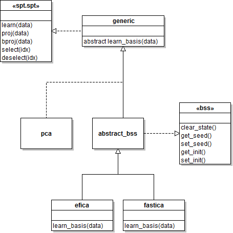

`abstract_bss` class
===

The `abstract_bss` class is an [abstract class][absclass] designed for
[inheritance][inheritance]. Thus you cannot create instance of this class.
However, you can use it a scheleton for building classes that wrap around
[BSS][bss] algorithms. The class `abstract_bss` provides default implementations
for all methods defined by the [bss interface][bss-ifc]. Class `abstract_bss` is
itself a child of the abstract class [generic][generic-class], which is
contained in the `spt.generic` package.

See the class diagram below to understand the role of class `abstract_bss`
within the hierarchy of SPT and BSS classes:

[absclass]: ./http://en.wikipedia.org/wiki/Abstract_type
[inheritance]: http://en.wikipedia.org/wiki/Inheritance_(object-oriented_programming)
[bss]: http://en.wikipedia.org/wiki/Blind_signal_separation
[bss-ifc]: ./bss.md
[generic-class]: ../+generic/README.md

