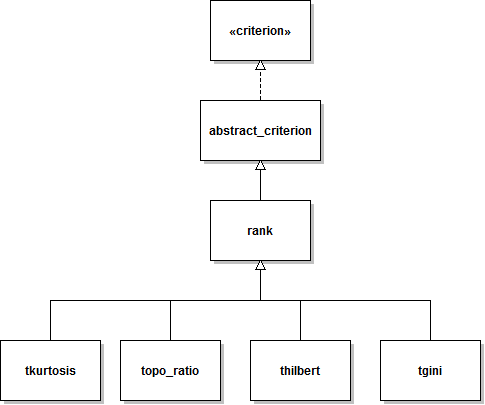

package `spt.criterion`
========

Package `spt.criterion` contains classes that implement various criteria
for identifying relevant spatio-temporal components. The most common use of 
the classes defined in this package is to define the way spatial components 
are selected during the operation of a [bss_regr][bss_regr] node. 

[bss_regr]: https://github.com/germangh/meegpipe/tree/master/+meegpipe/+node/+bss_regr/README.md

## Usage

All classes within this package implement the
[criterion interface][criterion-ifc]. Thus they are all used in the same
way. For instance, to rank components according to the [kurtosis][kurt] of
their time-series and select the 3 top-ranked components:

[criterion-ifc]: ./criterion.md
[kurt]: http://en.wikipedia.org/wiki/Kurtosis

````matlab
% A sample data matrix
data = rand(50,1000);

% Create a kurtosis-based selection criterion
% MinCard and MaxCard stand for minimum and maximum cardinality of the 
% set of selected components
myCrit = spt.criterion.tkurtosis.new('MaxCard', 3, 'MinCard', 3);

% Select the 3 time series with highest kurtosis
[sel, rank] = select(myCrit, [], data);
````

Notice that the `rank` output argument does not contain the actual kurtosis
values for each time-series, but rather a selection rank index that is 
proportional to the time series kurtosis, but whose value ranges from 0
(least preferred) to 1 (most preferred). 

Similarly, if we wanted to select the components having a [Gini index][gini]
value equal or below the 25% percentile value:

[gini]: http://arxiv.org/pdf/0811.4706.pdf

````matlab
myCrit = spt.criterion.tgini.new('Percentile', 25);
myCrit = not(myCrit);
sel = select(myCrit, [], data);
````

Note that we used [method not][criterion-ifc] to invert the behavior of the
`tgini` criterion. By default, such criterion will select the components with
highest Gini index value. The _negated_ version of the criterion will select
the components having lowest Gini indices.


## Available criteria

For a complete list of criteria, browse the [spt package][spt-pkg] contents.
Below you can find a (probably outdated) list of some popular criteria:

[spt-pkg]: ./

Criterion class			    | Description
---------------------------	| ---------------
[acf][acf]					| Autocorrelation at one or more lags
[and][and]                  | and-type aggregation of multiple criteria
[dummy][dummy]				| Select all components
[mrank][mrank]				| A compound criterion made of one or more [rank][rank] criteria
[psd_ratio][psd]         	| Power ratio between two spectral bands
[qrs_erp][qrs]				| Cross-correlation across QRS complex repetitions
[rank][rank]				| For inheritance only. See the [documentation][rank]
[sgini][sgini]				| Spatial sparsity using the [Gini index][gini]
[terp][terp]				| Cross-correlation across data trials
[tfd][tfd]					| Temporarl sparsity using [fractal dimension][fdim]
[tgini][tgini]				| Temporal sparsity using [Gini index][gini]
[thilbert][thilbert]		| Envelope stability using the [Hilbert transform][hilbert-transform]
[tkurtosis][tkurtosis]		| Temporal sparsity using [kurtosis][kurt]
[topo_ratio][topo_ratio]	| Power ratio between two sets of sensors
[var][var]                  | Explained data variance
[xcorr][xcorr]              | Cross-correlation with one or more reference signals

[acf]: ./+acf/README.md
[and]: ./@and/README.md
[dummy]: ./+dummy/README.md
[mrank]: ./+mrank/README.md
[psd]: ./+psd_ratio/README.md
[qrs]: ./+qrs_erp/README.md
[rank]: ./+rank/README.md
[sgini]: ./+sgini/README.md
[terp]: ./+sterp/README.md
[tfd]: ./+tfd/README.md
[tgini]: ./+tgini/README.md
[thilbert]: ./+thilbert/README.md
[tkurtosis]: ./tkurtosis/README.md
[topo_ratio]: ./+topo_ratio/README.md
[var]: ./+var/README.md
[xcorr]: ./+xcorr/README.md

[fdim]: http://arxiv.org/abs/1003.5266
[hilbert-transform]: http://en.wikipedia.org/wiki/Hilbert_transform

## Define your own criteria

For detailed instructions on how to define your own criteria see the 
documentation of the [dummy][dummy] criterion.


## Implementation details

Classes contained in the `spt.criterion` package are organized according to
the following class hierarchy:




