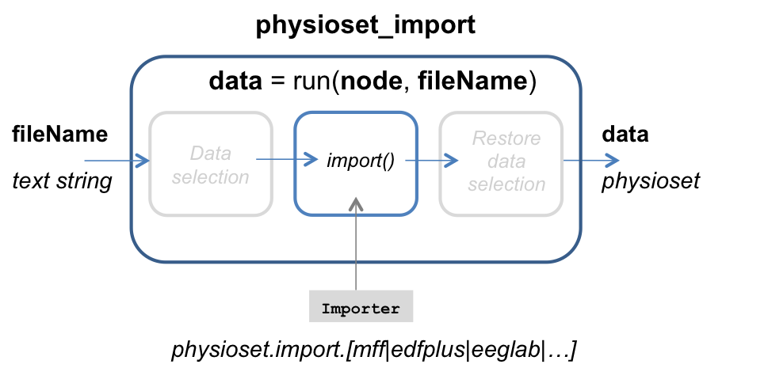
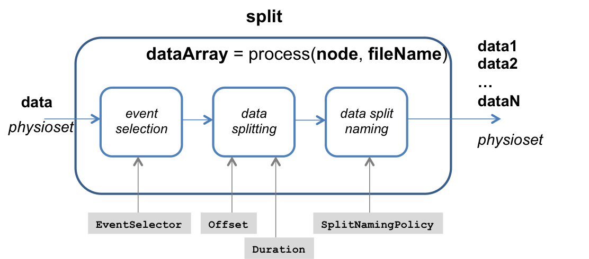
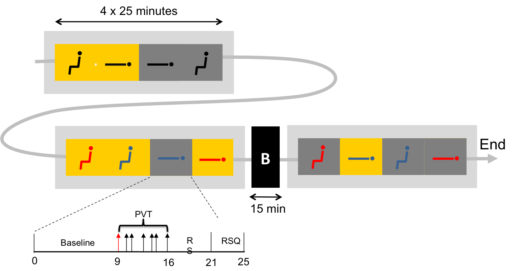

Split raw data files
===

[Go to the previous tutorial step][getting_raw_data]

The raw data files that we just [retrieved in the previous step][getting_raw]
of this tutorial are very large: about 30 GB each. It is certainly possible to
use `meegpipe` to work with such large files directly, but it is generally
a good idea to work with smaller chunks of your data at a time. You should
always aim to break your data into the smallest chunks that may be processed
independently. This splitting strategy may speed up processing dramatically.
_meegpipe_ can process each input file in a separate [grid engine][sge] job
(or [condor][condor] job) so, depending on the available resources on your grid
or computer cluster, all your files may be processed in parallel.

[condor]: http://research.cs.wisc.edu/htcondor/
[sge]: http://gridscheduler.sourceforge.net/
[getting_raw]: ./getting_raw_data.md

In this tutorial we want to extract features separately for each experimental
sub-block. Thus, it makes sense to split our original data files into 12
`baseline` sub-blocks, 12 `PVT` sub-blocks, 12 `RS` sub-blocks, and 12 `RSQ`
sub-blocks. That is, each raw data file is split into 48 files.


## Setting up `meegpipe`

Before anything else you need to add _meegpipe_ to MATLAB's search path:

````matlab
restoredefaultpath;
addpath(genpath('/data1/toolbox/matlab_v1.0.0'));
````

You also need to add to MATLAB's path a few third-party dependencies:

````matlab
meegpipe.initialize;
````

You only need to run the three commands above once for a given MATLAB session.


## Keeping your scripts organized

We are going to wrap all the scripts necessary to perform the file splitting
into a [MATLAB package][matlabpkg] called `batman`. Open MATLAB and type:

[matlabpkg]: http://www.mathworks.nl/help/matlab/matlab_oop/scoping-classes-with-packages.html

````matlab
cd /data1/projects/meegpipe/batman_tut/gherrero
mkdir +batman
````

From now on we will save all scripts under `+batman`.


## Main processing script

Before writing a data processing pipeline, I often prefer to write first the
scheleton of a _main_ processing script that takes care of all the necessary
preliminaries: picking the files to be processed, creating the processing
pipelines, and running the pipeline on the chosen set of files. Below I describe
step-by-step how I would write such a [split_files.m][split_files_m] script (or
function).

[split_files_m]: ./+batman/split_files.m

First I define the output directory where the split data files should be stored:

````matlab
OUTPUT_DIR = '/data1/projects/meegpipe/batman_tut/gherrero/split_files_output';
`````

I also define a few other parameters that I may want to play with when tuning
the processing pipeline. For instance, all processing nodes generate HTML
reports. These are very useful to determine whether the node did what it was
expected to do. However, when you have already ensured
that the nodes are working well, you may want to deactivate the HTML report
generation so that processing is faster. Depending on your pipeline
configuration and the size of your data files, the speedup can be _very
considerable_. We use variable `DO_REPORT` to take care of activating or
activating the report generation:

````matlab
DO_REPORT   = true; % Should full HTML reports be generated?
````

By default, _meegpipe_ always tries to process your files in the background, either
with [Open Grid Engine][sge] or with [Condor][condor], whatever is
available on your system. But when you are in the process of defining a new
pipeline, you first need to know whether it works at all. Thus you may prefer to
just process your files sequentially on your current MATLAB session so that
you can easily follow the execution status messages that _meegpipe_ produces.

````matlab
PARALLELIZE = true; % Should each file be processed in parallel?
````

We now create an instance of the data processing pipeline:


````matlab
% Create an instance of your data splitting pipeline
myPipe = batman.split_files_pipeline(...
    'GenerateReport', DO_REPORT, ...
    'Parallelize',    PARALLELIZE);
`````

Note that we have not written yet function `batman.split_files_pipelines.m`. But
let's assume that we have.

_meegpipe_ always stores the processing results on the same directory where the
input files are located. Of course you want to avoid as much as possible
creating redundant copies of your raw data files. So, instead of copying, we
create [symbolic links][symlink] to the relevant data files:

[symlink]: http://en.wikipedia.org/wiki/Symbolic_link

````
files = somsds.link2rec(...
            'batman', ...           % The recording ID
            'subject', [1 2], ...   % The subject ID(s)
            'modality', 'eeg', ...  % The data modality
            'folder',  OUTPUT_DIR); % The directory where the links will be generated
````

MATLAB function `somsds.link2rec` is just a wrapper over the `somsds_link2rec`
script that we used when we demonstrated [how to retrieve the raw data
files][getting_raw_data].

[getting_raw_data]: ./getting_raw_data.md

After running the code above, variable `files` should be a cell array containing
the full paths to the files that are to be split (or, rather, the full paths to
the symbolic links that point to those files).

The final and obvious step is to run the pipeline on the selected files:

````
run(myPipe, files{:});
````

## The splitting pipeline

Our [split_files.m][split_files_m] above made used of function
`batman.split_files_pipeline`, which took care of creating an instance of the
data processing pipeline. It is now time to write that function.


### Node 1: Importing the `.mff` files

Obviously, the first step in our processing pipeline needs to be converting the
raw `.mff` files into [physioset][physioset] objects, which is the data
structure that _meegpipe_'s processing nodes understand.

[physioset]: ../../+physioset/@physioset/README.md

Importing data from various disk file formats into a _physioset_ object is
always performed with a [physioset_import][physioset_import_node] node. Below
you have a schematic diagram of such a node:

[physioset_import_node]: ../../+meegpipe/+node/+physioset_import/README.md



__NOTE:__ In the diagram above I have depicted also the _data selection_ steps
that take place before and after the actual node processing. These steps are
common to all classes of processing nodes and, in the following, they will not
be shown in the node diagrams. See the documentation of the generic [node][node]
interface for more information.

[node]: ../../+meegpipe/+node/README.md

Nodes of class `physioset_import` admit only one configuration option,
_Importer_. The user needs to set it to an object of one of the physioset
importer classes that are available in package [physioset.import][physioset_import_pkg].
For instance, you may use a `physioset.import.edfplus` object for
importing [EDF+][edfplus_format] files. In our case, the raw data files are in
`.mff` format and thus we need a `physioset.import.mff` importer.

Realize that, although the `physioset_import` node has just one configuration
option (_Importer_), the actual data importer object has several properties that
allow you to specify various importing options. Let's build a _default_ mff
importer object to find out what properties it has:

[physioset_import_pkg]: ../../+physioset/+import/README.md
[edfplus_format]: http://www.edfplus.info/

````matlab
>> physioset.import.mff

ans =

mff
Package: physioset.import


      ReadDataValues : true
           Precision : double
            Writable : true
           Temporary : true
           ChunkSize : 500000000
   AutoDestroyMemMap : false
          ReadEvents : true
            FileName :
          FileNaming : inherit
             Sensors : []
        EventMapping : [1x1 mjava.hash]
          MetaMapper : @(data)regexp(get_name(data),'(?<subject_id>0+\d+)_.+','names')
         EventMapper : []
           StartTime :
````

One property that you may often want to override is the `Precision` property,
which determines the numeric precision that is used to store the values
contained in the generated `physioset` object. The code below will create a
`physioset_importer` node that will convert an `.mff` data file into
a `physioset` object of `single` precision:

````matlab
% This import directive allows us to write physioset_import.new instead of the
% fully qualified name meegpipe.node.physioset_import.new. You only need to run
% this directive once (within a given MATLAB session), unless you run command
% "clear all", which also clears the current import list.
import meegpipe.node.*;

% Let's build our data importer with a custom Precision value
myImporter = physioset.import.mff('Precision', 'single');

% Now, let's build a physioset_import node that uses the importer object above
myNode = physioset_import.new('Importer', myImporter);
````

And that's it for the first node in our file splitting pipeline. Let's move on
to the next node.


### Node 2: Splitting the imported physioset

Nodes of class [split][split_node] allow you to split a physioset object into
several (possible overlapping) data subsets. Below you have the node schema:

[split_node]: ../../+meegpipe/+node/+split/README.md





Nodes of class `split` determine the time range of each data split by selecting
a subset of events among the events present in the input physioset. The subset
of relevant events is selected using a user-defined `EventSelector`. To
understand how this works, let's take a look at the default value of
`EventSelector`:

````matlab
defEvSel = get_config(split.new, 'EventSelector')

ans =

class_selector
Package: physioset.event


               Class : { 'split_begin'}
                Type : {}
             Negated : false
                Name :
````

So, by default, the `split` node looks for `split_begin` events in the input
physioset and splits the dataset according to the `Offset` and `Duration` of
such events. The example below illustrates this behavior with a random toy
physioset:

````matlab
import meegpipe.node.*;

% Create a toy physioset object that contains random values
myImporter = physioset.import.matrix('FileName', 'mytoydata');
myPhysioset = import(myImporter, rand(3,1000));

% In your current directory there should now be a file called `mytoydata.pset`
% which contains the physioset data values.

% Add two split_begin events at samples 100 and 500, with a duration of 500 samples
myEvArray = physioset.event.std.split_begin([100 500], 'Duration', 500);
add_event(myPhysioset, myEvArray);

% Split it!
myNode = split.new;
run(myNode, myPhysioset);
````

The messages displayed in the MATLAB command window should provide you all the
details regarding the two data splits that were just generated. The same
information together with instructions on how to retrieve the produced data
splits is found in the HTML report generated by the `split` node. You will find
the report under directory `./mytoydata.meegpipe/split-[something]`. Open the
report and click on the _Split mytoydata-split1_ link, under the _Produced data
splits_ section. At the bottom of the page you will find the code snippet that
you need to retrieve the first split physioset. In my case the code snippet
reads:

````matlab
data = pset.load(['/Volumes/DATA/work/' ...
    'mytoydata.meegpipe/split-3fa41e_gherrero_MACI64-R2012a/' ...
    'mytoydata_split1.pseth'])
````

Let's check whether the first split contains the expected values:

````matlab
% The first split should contain these data values:
myManualSplit1 = myPhysioset(:, 100:599);

% This should not throw an error if everything went OK
assert(all(data(:)==myManualSplit1(:)));
````

#### Splitting strategy for the BATMAN recordings

For various practical reasons related with issues that occured during the
recordings of the BATMAN dataset, the only events that we can reliably use to
produce the desired data splits in all files are the `PVT` events. Namely, the
first `PVT` event within a given manipulation block can be used to determine the
onset of the `PVT` sub-block:



Thus we can use the following strategy to split the files:

1. Select the first `PVT` event within every _PVT_ sub-block. This step should
   produce 12 such events.

2. For each event selected in 1., let's assume that the time of the event is `t`.
   Then, produce four splits:

Split name                     | Offset from `t` (mins) | Duration (mins)
------------------------------ | ---------------------- | ------------------
`[dataName]_baseline_[block#]` | -9                     | 9
`[dataName]_pvt_[block#]`      |  0                     | 7
`[dataName]_rs_[block#]`       |  7                     | 5
`[dataName]_rsq_[block#]`      | 12                     | 4


#### Splitting strategy implementation

The most complex aspect of our splitting strategy is how to robustly identify
the first `PVT` event within a given _PVT_ sub-block. The details are beyond the
scope of this tutorial, but suffice to say that function
[pvt_selector][pvt_selector] implements an event selector that will do the job.
You can use the latter as a model for your own custom event selectors.

[pvt_selector]: ./+batman/pvt_selector.m

One detail that is still missing is how to ensure that the produced splits are
given meanigful names. E.g. we would like the _RS_ split for the second
experimental manipulation block of file `batman_0001_eeg_all.mff` to be called
`batman_0001_eeg_all_rs_2`. Node _split_ names the generated splits according to
a user-defined naming function (configuration option `SplitNamingConvention`.
Such a naming function is provided as arguments the physioset object that enters
the `split` node, the relevant splitting event, and the index of such event
within the set of all splitting events. For more details, you may take a look
at function [split_naming_policy][split_naming].

[split_naming]: ./+batman/split_naming_policy.m

Using our custom event selector we could define a `split` node that would split
away all _baseline_ sub-blocks as follows:


````matlab
import meegpipe.node.*;

% Create an instance of the custom event selector that selects the first PVT
% event within every PVT sub-block.
myEvSel = batman.pvt_selector;

% See the note after this code snippet for more info on this one
splitNaming = @(physObj, ev, evIdx) ...
    batman.split_naming_policy(physObj, ev, evIdx, 'baseline');

% This is not really required, but since in this tutorial we are not interested
% in the EEG data, it is a good idea to select only non-EEG data when generating
% the splits so that we have as small data splits as possible. Notice the
% ~ symbol, which means: select everything except EEG data. The  ~ symbol
% "negates" a data selector so that it selects the complementary set to the
% data set that it would normally select. You can check whether a data
% selector has been negated by inspecting the value of its Negated property.
myDataSel = ~pset.selector.sensor_class('Class', 'EEG');

% Create the split node. It is important to give a meaningful name to the node.
myNode = split.new(...
    'DataSelector',      myDataSel, ...
    'EventSelector',     myEvSel, ...
    'Offset',            -9*60, ...         % Must be in seconds
    'Duration',          9*60, ...          % Also in seconds
    'SplitNamingPolicy', splitNaming, ...
    'Name',             'baseline', ...

````

The purpose of the `SplitNamingPolicy` configuration option is to define the
naming strategy for the generated (split) files. It is defined with a
[function_handle][function_handle] that takes three arguments: the physioset
object that is being split, the event object that defines the current split, and
the index of the current split. This is an implementation
detail that is not that relevant, but you may want to take a look at how I
implemented my [split naming policy][split_naming_policy_m].

[split_naming_policy_m]: ./+batman/split_naming_policy.m

### Putting it all together

The final outcome of this section of the tutorial is:

* A function that takes care of building the _meegpipe_ pipeline:
  [split_files_pipeline.m][split_files_pipeline].

* A _main_ function that takes care of gathering all the relevant data files,
  and of processing them with the splitting pipeline:
  [split_files.m][split_files].

[split_files_pipeline]: ./+batman/split_files_pipeline.m
[split_files]: ./+batman/split_files.m


Once both of these functions are in your MATLAB search path you can simply run
the following to split all data files:

````matlab
% I assume that you have wrapped your scripts with a package called batman
batman.split_files
````

## [Continue to the next step ...][abp]

[abp]: ./abp_feat.md
