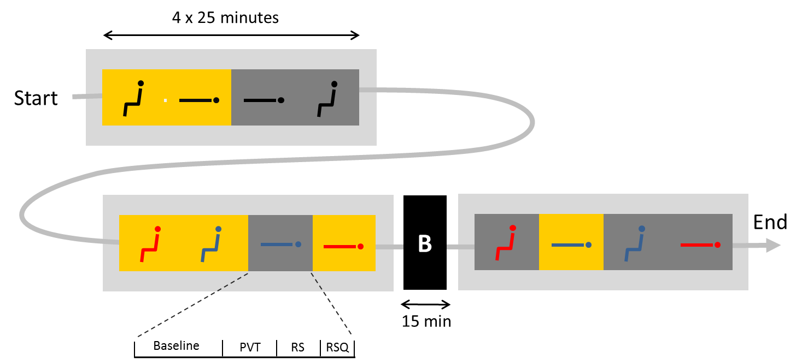

Manually cleaning an EEG dataset
===

This tutorial illustrates how to use _meegpipe_ to manually clean the
_BATMAN EEG dataset_. Although one of _meegpipe_'s goals is to automate as much
as possible your data cleaning pipelines, it also supports
fully-supervised cleaning. The latter may be preferable when your dataset is
relatively small, and/or exceptionally noisy.

Below I assume that you are following this tutorial at the _somerengrid_, i.e.
at one of the nodes of the private computing grid of the [Sleep&Cognition][sc]
team of the [Netherlands Institute for Neuroscience][nin]. In particular, the
raw data files that are used in this tutorial are not yet publicly available.

## Experimental data

The BATMAN (Behavior, Alertness, and Thermoregulation: a Multivariate ANalysis)
project pursues to identify major thermoregulatory system parameters, and their
effects on behaviour and alertness, in a completely unrestrained ambulatory
setting. Achieving this goal will involve ambulatory measurement of all relevant
inputs and outputs: physical activity, posture, environmental light and
body temperature, electrocardiography, and skin temperature by means of a
multi-sensor system as well as questionnaires and reaction times assessed on a
PDA. These parameters will be validated against those derived under strictly
controlled laboratory manipulations. In the case of the laborary experiments we
record also high-density [EEG][eeg] (hdEEG).

[eeg]: http://en.wikipedia.org/wiki/Electroencephalography

This tutorial illustrates the process of cleaning the EEG data that was acquired
during the laboratory recordings of the BATMAN project.

### Experimental (lab) protocol

In a nutshell, the laboratory protocol involved various environmental manipulations
(posture, skin temperature, ambient light) that are expected to trigger
relevant thermoregulatory system responses. Such responses were characterized
using a diverse set of variables: arterial blood pressure, ECG, skin and core
temperature, and hdEEG. In order to assess effects on behavior and alertness, the
subjects performed a PVT response-time task, and filled the Amsterdam Resting
State Questionnaire while being subjected to these experimental manipulations.
In total there were 12 experimental blocks, as illustrated in the diagram below:

Note that each __experimental block__ consisted of four __sub-blocks__:
A _baseline_ sub-block when the subject was instructed to simply wait with
her eyes open, a _PVT_ sub-block that involved a simple reaction-time task, a
_RS_ sub-block when the subject stared at a cross hair, and an _RSQ_ sub-block
when the subject filled the resting state questionnaire.

## Objectives/Roadmap

In [a previous tutorial][batman-tutorial] we went through the process of
splitting the large BATMAN data files into single-sub-block files, which are
more manageable. This tutorial uses the splitted files as input. Below you have
the steps that we will take us to a perfectly clean and ready for analysis
dataset:

[batman-tutorial]: ../batman/README.md

1. [Retrieve the relevant data files][getting_raw]. As I already mentioned
   above, our start point will be the splitted `.pset/.pseth` files that we
   generated in a [previous tutorial][batman-tutorial].

[getting_raw]: ./getting_raw_data.md

2. [Define a (supervised) cleaning pipeline][pipeline-def].

[pipeline-def]: ./pipeline_definition.md

3. [Process all files][pipeline-run] with the pipeline that we defined in 2).
   It is in this last step when the input of the user is required for various
   decisions that are taken internally in the processing nodes.

[pipeline-run]: ./pipeline_run.md
