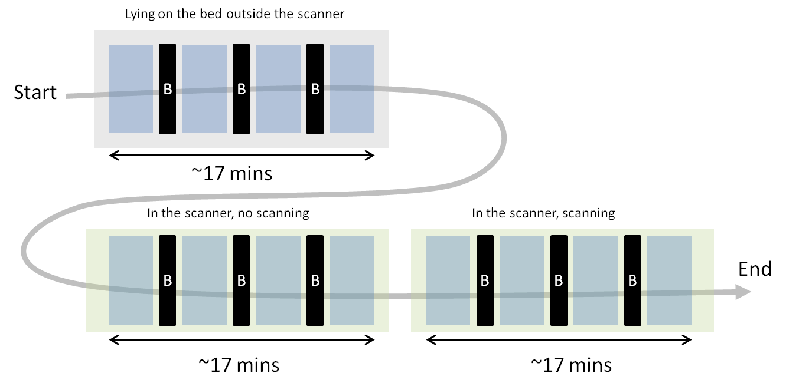
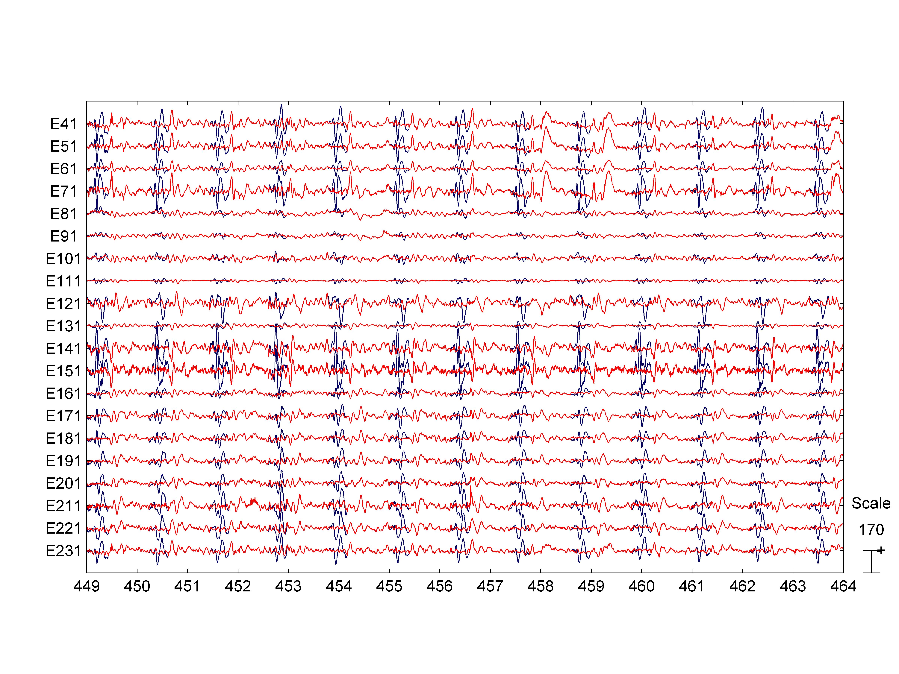

Tutorial: Correction of BCG artifacts from EEG-fMRI recordings
========


## Background

Electroencephalography ([EEG][eeg]) and Functional Magnetic Resonance Imaging 
([fMRI][fmri]) are two prominent tools that neuroscientists use to
non-invasively assess human brain function. These two neuroimaging techniques
have complementary  strengths. EEG has an excellent temporal resolution (in the
order of milliseconds), therefore allowing the experimenter to study the
fast brain processes that underlie cognition. EEG can accurately tell us
when a functional brain process starts and when it ends. On the other hand, 
fMRI's strong point is its spatial resolution, meaning that it can tell very 
precisely where in the brain something is happening. 

Indeed, it has been over 20 years now since the first attempts at combining these
two powerful imaging modalities. However, wide application has been hampered by
the great technical difficulties that such combined approach involves. 
Difficulties that have become even more challenging with the recent advent of 
high-density EEG (hdEEG) and high-field fMRI. 

In this tutorial we will try to deal with one of the main limitations of 
simultaneous hdEEG-fMRI: the Ballistrocardiographic (BCG) artifact, which
severely contaminates EEG recordings obtained in an MRI setting. The BCG 
artifact can be several orders of magnitude larger than neural EEG sources. 
It is of cardiac origin but its precise generation mechanisms are still a 
matter of debate. Most likely it is caused by tiny pulse-related movements
of the EEG electrodes. Recall from [Faraday's law of induction][faraday] that
a static magnetic field (such as the one in an MR scanner) induces current on
a moving conductor loop (such as the one formed by a given EEG sensor and the 
reference point). These currents lead to large spurious changes of the EEG 
potentials: The BCG artifact. 

[faraday]: http://en.wikipedia.org/wiki/Electromagnetic_induction
[eeg]: http://en.wikipedia.org/wiki/Electroencephalography
[fmri]: http://en.wikipedia.org/wiki/Functional_magnetic_resonance_imaging


## Experimental data

### Experimental paradigm

The experimental paradigm is very simple. It consists multiple repetitions of
a Checkerboard inversion visual sequence. Subjects did not have to do anything
else than looking at the screen. There are three experimental conditions: 
_outside the scanner_, _inside the scanner without scanning_, and _inside the
scanner while scanning_.  In the first condition subjects were lying on a bed
in the MR scanner control room (i.e. outside the scanner room). Subjects were
presented 4 experimental blocks (blue boxes in the diagram), each of which 
consisted of 5 sub-blocks (not marked in the diagram below). 

Each sub-block is separated from each other by a 10 seconds fixation period
when subjects were asked to look at the red cross in the middle of the screen. 
Between each block there is a break (black boxes below) that lasts 50 seconds.
Subjects were not required to look at the screen during breaks. However, 
they were requested not to fall asleep during the whole duration of the
experiment and not to keep their eyes closed for long periods of time (i.e. 
subjects should not keep the eyes closed during the whole duration of a break). 
The task is really boring so you cannot rule out completely the possibility that, 
despite our instructions, some subjects did fall asleep during short periods of the
experiment. 



### Files used in this tutorial

For this tutorial we will use two EEG data files, which were recorded while
the subjects (identified by codes `0002` and `0003`) were lying inside the
scanner bore (without scanning):

* [bcgg_0002_eeg_in_check.mff.7z](http://kasku.org/data/bcgg/bcgg_0002_eeg_in-check.mff.7z)
* [bcgg_0003_eeg_in_check.mff.7z](http://kasku.org/data/bcgg/bcgg_0003_eeg_in-check.mff.7z)


The data files are compressed using [7zip](http://www.7-zip.org/). Note that the 
scanner pump was off when these two files were recorded. 

The files are hosted at my personal site and, therefore, download speeds can be
quite low. Since the data files are also released under the same licence as _meegpipe_ 
(a [Creative Commons Attribution-NonCommercial-ShareAlike licence][licence]), you 
are free to host the files on your own server, as long as you give proper credit 
(see section Credit at the end of this document).

[licence]: http://creativecommons.org/licenses/by-nc-sa/3.0/

### Working at somerengrid

If you are working at the somerengrid then you don't need to download the files. Just 
open a terminal and type:

	mkdir ~/tutorial
	cd ~/tutorial
	somsds_link2rec bcgg --modality eeg --subject 2,3
	
The commands above will create symbolic links to the relevant data files under 
`~/tutorial/bcgg`.


## Defining the cleaning pipeline

The code below will generate a processing pipeline that will clean our EEG recordings 
using Optimal Basis Sets ([OBS][obs]), which is the most widely used approach for 
removing BCG artifacts from EEG-fMRI recordings:

````matlab
eval(meegpipe.alias_import('nodes'));

myPipe  = pipeline('NodeList', ...
    { ...
    pipeline.basic(1000), ...
    qrs_detect, ...
    obs, ... 
    }, ...
    'Name', 'obs-pipeline', 'Save', true);
````

[obs]: http://www.ncbi.nlm.nih.gov/pubmed/16150610

As you can see, our pipeline builds upon the pre-defined pipeline `basic`. 
Such basic pipeline is very similar (but not exactly identical) to the one
that we defined using script `basic_pipeline` in the 
[hdEEG ERP tutorial][eeg-erp]. You can see the internal details of the
`basic` pipeline:

	edit meegpipe.node.pipeline.basic
	
After the `basic` pipeline, we use a node of class [qrs_detect][qrs-detect]
to detect QRS occurrences from the ECG channel that is included with our
EEG data files. Each QRS instance is then marked by introducing suitable 
events (of class [physioset.event.std.qrs][qrs-event]) in the physioset
object. The latter will be then used by node [obs][obs-node] to build a
BCG template.

[eeg-erp]: http://github.com/germangh/meegpipe/blob/master/tutorials/eeg-erp.md
[obs-node]: http://github.com/germangh/meegpipe/blob/master/%2Bmeegpipe/%2Bnode/%2Bobs/%40obs/obs.m
[qrs-detect]: https://github.com/germangh/meegpipe/blob/master/%2Bmeegpipe/%2Bnode/%2Bqrs_detect/%40qrs_detect/qrs_detect.m
[qrs-event]: https://github.com/germangh/matlab_physioset/blob/master/%2Bphysioset/%2Bevent/%2Bstd/qrs.m

## Running the pipeline

Simply:

````matlab
run(myPipe, ...
	{'bcgg_0002_eeg_in-check.mff', 'bcgg_0003_eeg_in-check.mff'});
````

If [OGE][oge] is available in your system, the command above will 
submit to the grid a separate processing job for each input data file. 
Otherwise, `run()` will just run the pipeline sequentially on the two
data files that you provided.

[oge]: http://www.oracle.com/us/products/tools/oracle-grid-engine-075549.html


## A baseline to compare with

In order to assess whether OBS did or did not do a good job in removing the 
BCG artifacts, you may want to process your data files also using just the 
`basic` pipeline:

````matlab
run(pipeline.basic(1000), ...
	{'bcgg_0002_eeg_in-check.mff', 'bcgg_0003_eeg_in-check.mff'});
````

Comparing the output of OBS with the raw data would not be as easy as comparing
OBS with the output of the basic pipeline. The reason is that the raw data 
files have very prominent low frequency trends which makes comparisons very 
complicated. 


## Where are the results stored?

Command `run()` will store all results in two directories called:
	
	bcgg_0002_eeg_in-check.meegpipe/obs-pipeline-[cfg]_[usr]_[sys]
	bcgg_0003_eeg_in-check.meegpipe/obs-pipeline-[cfg]_[usr]_[sys]

Where `[cfg]` is an 8 characters long hash code, which identifies the
pipeline configuration. Then `[usr]` is the name of the user that executed 
command `run()`, and `[sys]` is a string identifying the operating system
and MATLAB version (e.g. `PCWIN64-R2011b`).

Within those two directories, the files that contain the processed
data are called:

	bcgg_0002_eeg_in-check_obs-pipeline.pset
	bcgg_0002_eeg_in-check_obs-pipeline.pseth
	bcgg_0003_eeg_in-check_obs-pipeline.pset
	bcgg_0002_eeg_in-check_obs-pipeline.pseth
	
Of those files, the `.pset` files contain the actual data values 
while the `.pseth` files contain the associated metadata. You should
take care of keeping the `.pset`/`.pseth` pair together whenever 
you decide to move the data files to another location in 
the file system. 

If you decided to process your data files also with the `basic` 
pipeline, then the corresponding results will be stored in directories:

	bcgg_0002_eeg_in-check.meegpipe/basic-pipeline-[cfg]_[usr]_[sys]
	bcgg_0003_eeg_in-check.meegpipe/basic-pipeline-[cfg]_[usr]_[sys]
	

### Loading the processed data into MATLAB

To load the processed data for subject `0003` in MATLAB:

````matlab
import physioset.*;
myData = physioset.load(...
	['bcgg_0002_eeg_in-check.meegpipe/' ...
	'obs-pipeline-[cfg]_[usr]_[sys]/' ...
	'bcgg_0002_eeg_in-check_obs-pipeline.pseth'])
	
% We load also the output of the basic pipeline
myBasicData = physioset.load(...
	['bcgg_0002_eeg_in-check.meegpipe/' ...
	'basic-[cfg]_[usr]_[sys]/' ...
	'bcgg_0002_eeg_in-check_basic.pseth'])
````

Then, to display it:

````matlab
% Select only a subset of channels
select(myData, 1:10:250);
select(myBasicData, 1:10:250);
plot(myBasicData, myData);
````

which should display something like the figure below.



As you can see OBS was reasonably successful at removing the most prominent 
peak of the BCG artifact but it left quite a lot of residuals behind. 

After using command `select` to plot only a subset of channels, always 
remember to restore the original data selection:

````matlab
restore_selection(myData);
restore_selection(myBasicData);
````

## HTML reports

_meegpipe_ generates a comprehensive HTML report for each data file that it processes. 
In fact, for short recordings like the ones used in this tutorial, _meegpipe_ will 
spent most of the time just generating the reports. At this point, it is not possible 
to deactivate the reporting features, which means that even if you don't need the 
reports, _meegpipe_ will generate one. I will include that possibility in future versions 
but it is not in my top priorities list.

__IMPORTANT:__ In some cases, the reports may contain lots of vector graphics 
([.svg][svg] files). At the time of this writing most browsers handle poorly pages with 
lots of embedded .svg files. By far the best performing one is [Google Chrome][chrome].

[chrome]: https://www.google.com/intl/en/chrome/browser/
[svg]: http://en.wikipedia.org/wiki/Scalable_Vector_Graphics

To see the report associated with file `bcgg_0002_eeg_in-check.mff` open this 
file on your browser:

	bcgg_0002_eeg_in-check.meegpipe/obs-pipeline-[cfg]_[usr]_[sys]/remark/index.htm
	

## Fine-tuning the pipeline

There are two way you can optimize the results of a given pipeline:

* Modifying the configuration of the pipeline nodes.
* Manually modifying runtime parameters of a given node. By this we mean that you can manually
override some of the runtime decisions made by _meegpipe_. For instance, you can directly tell 
_meegpipe_ to reject this and that channel, regardless of what _meegpipe_'s automatic criteria 
say. 

For more information see [meegpipe's documentation][meegpipe-docs] (work on progress, so 
the link does not work yet).

[meegpipe-docs]: #

## BCG cleaning using carbon wire regression (CWR)

You can fine-tune the OBS pipeline as much as you want but the results will not 
improve dramatically. Apart from the EEG and ECG signals, these datasets contain 
also 3 signal recorded with carbon wires (loops) attached to the sensor net. 
Such loops record BCG and and movement-related activity but are free of any neural
EEG activity. Thus, we can attempt to remove the BCG artifact by regressing the
carbon wire signals from the EEG signals:

````matlab
eval(meegpipe.alias_import('nodes'));

myPipeCWR  = pipeline('NodeList', ...
    { ...
    pipeline.basic(1000), ...
    aregr.bcg ... 
    }, ...
    'Name', 'cwr-pipeline', 'Save', true);

run(myPipeCWR, ...
	{'bcgg_0002_eeg_in-check.mff', 'bcgg_0003_eeg_in-check.mff'});	
````

## Other pipelines

Defining new pipelines is equally easy. For instance, to remove
the BCG artifact using [Independent Component Analysis][ica], 
namely the [multicombi][mcombi] algorithm:

[ica]: http://en.wikipedia.org/wiki/Independent_component_analysis
[mcombi]: http://www.germangh.com/papers/ieeetnn08.pdf

````matlab
eval(meegpipe.alias_import('nodes'));
import spt.bss.multicombi.multicombi;

myPipeMCOMBI  = pipeline('NodeList', ...
    { ...
    pipeline.basic(1000, 'GenerateReport', false), ...
	qrs_detect, ...
	reref.avg, ...
    bss_regr.bcg(250, 'BSS', multicombi)...
    }, ...
    'Name', 'mcombi-pipeline', 'Save', true);
	
run(myPipeMCOMBI, ...
	{'bcgg_0002_eeg_in-check.mff', 'bcgg_0003_eeg_in-check.mff'});	
````

Node [qrs_detect][qrs_detect] will add events to the physioset at
the locations of QRS complexes. This is required by node 
[bss_regr.bcg][bss_regr-bcg] to identify the spatial components that are
BCG related. Node [reref][reref] is not strictly necessary but imposing
an average reference can make the reports generated by the
[bss_regr][bss_regr] node more informative.

[qrs_detect]: ../%2Bmeegpipe/%2Bnode/%2Bqrs_detect
[bss_regr-bcg]: ../%2Bmeegpipe/%2Bnode/%2Bbss_regr/bcg.m
[bss_regr]: ../%2Bmeegpipe/%2Bnode/%2Bbss_regr
[reref]: ../%2Bmeegpipe/%2Bnode/%2Breref


And to use a concatenation of CWR and ICA:


````matlab
eval(meegpipe.alias_import('nodes'));
import spt.bss.multicombi.multicombi;

myPipe  = pipeline('NodeList', ...
    { ...
    pipeline.basic(1000, 'GenerateReport', false), ...
	aregr.bcg, ... 
	qrs_detect, ...
	reref.avg, ...
    bss_regr.bcg(250, 'BSS', multicombi)...
    }, ...
    'Name', 'cwr-mcombi-pipeline', 'Save', true);

run(myPipe, ...
	{'bcgg_0002_eeg_in-check.mff', 'bcgg_0003_eeg_in-check.mff'});	
````

Note that when we constructed the basic pipeline above we set the 
configuration property `GenerateReport` to false. The result is that
all nodes within the basic pipeline will generate minimal reports,
which can speed up computation time considerably. However, the 
minimal reports are really minimal so you should set up 
`GenerateReport` to false once you are not interested anymore in 
assessing the results at each processing node.


## Computing ERP waveforms

You can also use _meegpipe_ to compute the average ERP waveforms. For that you will need
to add a few more nodes to your pipeline:


````matlab
eval(meegpipe.alias_import('nodes'));
import physioset.event.class_selector;
import meegpipe.node.bad_epochs.criterion.stat.stat;

% This "event selector" object will select the events that are relevant
% for ERP computation:
mySel = class_selector('Type', 'D252');

% This node will be used to reject noisy epochs before computing the ERP
myCrit = stat(...
    'Statistic1', @(x) max(abs(x)), ...
    'Statistic2', @(x) max(x), ...
      'Percentile', [0 85]);
myBadEpochsNode = bad_epochs(...
    'EventSelector', mySel, ...
    'Criterion',     myCrit);
	
% ERP node for the P1 component
myErpNode = erp(...
	'EventSelector',    mySel, ...
	'Duration',         0.7, ...
    'Offset',           -0.2, ...
    'Baseline',         [-0.2 0], ...
    'PeakLatRange',     [0.1 0.2], ...
    'AvgWindow',        0.05, ...
    'MinMax',           'max', ...
    'Filter',           filter.ba(ones(1, 10)/10, 1), ...
	'TrialsFilter', 	filter.ba(ones(1, 15)/15, 1), ...
    'Channels',         {{	'EEG 116', 'EEG 123', 'EEG 124', 'EEG 125', 'EEG 126', ...
							'EEG 135', 'EEG 136', 'EEG 137', 'EEG 138', 'EEG 148', ...
							'EEG 149', 'EEG 150', 'EEG 158'}});
							
myPipe  = pipeline('NodeList', ...
    { ...
    pipeline.basic(1000), ...
    aregr.bcg, ... 
	chan_interp, ...
    myBadEpochsNode, ...
	myErpNode ...
    }, ...
    'Name', 'cwr-erp-pipeline', 'Save', true);

	
run(myPipe, ...
	{'bcgg_0002_eeg_in-check.mff', 'bcgg_0003_eeg_in-check.mff'});	   
````

The resulting ERP figure (which can be found in the generated HTML report) is 
shown on the right below. Compare it with the ERP image obtained for the OBS 
method which is shown on the left.


### The bad_epochs node

Nodes of [class bad_epochs][bad-epochs-class] reject data epochs using different 
rejection criteria. At the moment of this writing _meegpipe_ includes only one
such criteria, which is implemented by class 
[meegpipe.node.bad_epochs.criterion.stat.stat][stat-criterion]. In the example 
above, the `bad_epochs` node will reject all those epochs whose maximum absolute 
value is above the 90th percentile or below the 3rd percentile, i.e. all epochs
having abnormally small or abnormally large maximum absolute values. 

### The erp node

Nodes of [class erp][erp-class] compute average ERP waveforms for selected
sets of sensors. In the example above, only one set of channels will be 
considered (consisting of channels `EEG 116`, `EEG 123`, etc). The ERP 
waveform will be computed by averaging (i) across all channels in the set and
(ii) all stimulus repetitions. An ERP peak will be search for between 100 and
200 ms after stimulus onset. Such peak will be identified as the most prominent
local maximum (thus the `'max'` for property `MinMax`) within that window. 

Property `EventSelector` determines which events are used for ERP
 computation. In the example above, all events of type `D252`. 

[bad-epochs-class]: ../%2Bmeegpipe/%2Bnode/%2Bbad_epochs/%40bad_epochs/bad_epochs.m
[stat-criterion]: ../%2Bmeegpipe/%2Bnode/%2Bbad_epochs/%2Bcriterion/%2Bstat/%40stat/stat.m
[erp-class]: ../%2Bmeegpipe/%2Bnode/%2Berp/%40erp/erp.m


## Exporting the processed data

Typically, you will want to futher process/analyze your data using another 
toolbox. To convert to [EEGLAB][eeglab] or [Fieldtrip][ftrip] format:

`````matlab
myEeglabdata = eeglab(myData);
myFtripData  = fieldtrip(myData);
````

[eeglab]: http://sccn.ucsd.edu/eeglab/
[ftrip]: http://fieldtrip.fcdonders.nl/


## Credit

The data acquisition was performed by [Arjan Miedema][arjan], 
[Yoshi Onuki][yoshi], and [German Gomez-Herrero][ggh]. The recordings took 
place at the [Spinoza Center][spinoza] while Arjan, Yoshi and German worked for
the [Netherlands Institute for Neuroscience][nin].

The OBS correction pipeline used in this tutorial relies on the OBS
 implementation in the [FMRIB plug-in for EEGLAB][fmrib], including some 
 minor modifications by [Johan Van Der Meer][johan]. 


[johan]: http://nl.linkedin.com/pub/johan-van-der-meer/10/554/3a0
[fmrib]: http://www.fmrib.ox.ac.uk/eeglab/fmribplugin/
[ggh]: http://germangh.com
[arjan]: http://www.linkedin.com/pub/arjan-miedema/11/762/371
[yoshi]: http://nl.linkedin.com/pub/yoshi-onuki/30/28a/535
[nin]: http://www.herseninstituut.knaw.nl/
[spinoza]: http://www.spinozacenter.nl/


