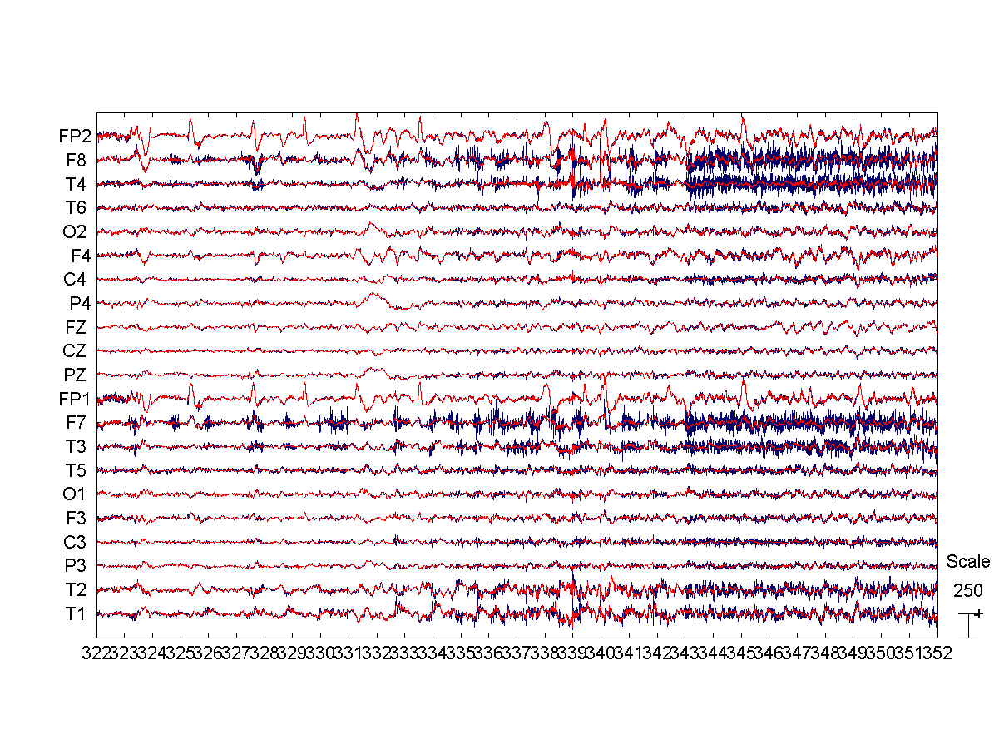

Minimizing EMG activity using BSS-CCA
===

This tutorials illustrates how _meegpipe_ can be used to correct muscle
artifacts using [Canonical Correlation Analysis][cca]. The original method
details are described in the following scientific reference:

> De Clercq, W. et al., _Canonical Correlation Analysis Applied to Remove Muscle
Artifacts from the Electroencephalogram_, IEEE Trans. Biomed. Eng. 53 (12), pp.
2583-2587. DOI: [10.1109/TBME.2006.879459](http://dx.doi.org/10.1109/TBME.2006.879459)

[cca]: http://en.wikipedia.org/wiki/Canonical_correlation

## Prerequisites

I am going to assume that you have already installed and ininitialized
_meegpipe_. If you haven't done so, then please follow the [installation
instructions](http://germangh.com/meegpipe). For this tutorial you do not need
to install any of the recommended dependencies.

## The sample dataset

For this tutorial I will use a [sample data epoch][data] from the dataset that
was used in the publication below:

[data]: https://dl.dropboxusercontent.com/u/4479286/meegpipe/f1_750to810.set

> Gomez-Herrero, G et al., _Automatic removal of ocular artifacts in the EEG_
> _without a reference EOG channel _, Proc. NORSIG 2006, pp. 130-133, 2006.
> DOI:
> [10.1109/NORSIG.2006.275210](http://dx.doi.org/10.1109/NORSIG.2006.275210)

Start MATLAB and get the sample dataset by copying and pasting the following
code into MATLAB's command window:

````matlab
unzip('https://dl.dropboxusercontent.com/u/4479286/meegpipe/f1_750to810.zip');
````

## The cleaning pipeline

The EMG cleaning pipeline is going to consist of three nodes: One for importing
the data (in EEGLAB's `.set` format), one for performing the cleaning/filtering
operation, and one to export the result back into EEGLAB's `.set` format. The
code snippet below defines and builds such a pipeline:

````matlab
% This cell array will store the list of nodes
nodeList = {};

% The first node: imports .set files into MATLAB
myImporter = physioset.import.eeglab;
myNode = meegpipe.node.physioset_import.new('Importer', myImporter);
nodeList = [nodeList {myNode}];

% The second node: uses a BSS-CCA filter to try to minimize EMG artifacts
% CCA is performed in sliding windows of 5 seconds (with 50% overlap) and the
% correction threshold is set to 75% (0%=no correction, 100%=output is flat).
% We use a very harsh correction to see the effects better
myNode = aar.emg.cca_sliding_window(...
    'WindowLength',     5, ...
    'WindowOverlap',    50, ...
    'CorrectionTh',     90);
nodeList = [nodeList {myNode}];

% The third node: store the results as an EEGLAB's .set file
myExporter = physioset.export.eeglab('FileName', 'cleaned-data');
myNode = meegpipe.node.physioset_export.new('Exporter', myExporter);
nodeList = [nodeList {myNode}];

% We are now ready to build the pipeline (which I decide to name 'emg-corr')
myPipe = meegpipe.node.pipeline.new(...
    'NodeList', nodeList, ...
    'Name',     'emg-corr');
````

### What if the original data is not in EEGLAB format?

The pipeline definition above assumes that the input data file is in EEGLAB's
`.set` format. Modifying the pipeline to accept other data formats as input is
typically very easy. You just need to specify a different value for the
`Importer` property of the `physioset_import` node. If your input data is in
[Fieldtrip][ftrip] format you would just need to replace the definition of the
first pipeline node with this one:

[ftrip]: http://fieldtrip.fcdonders.nl/

````matlab
% Use this alternative definition for the first node if your input data is a
% '.mat' file that stores a Fieldtrip data structure
myImporter = physioset.import.fieldtrip;
myNode = meegpipe.node.physioset_import.new('Importer', myImporter);
````

If the original data was in [EGI][egi]'s proprietary `.mff` format then you
would have done instead:

[egi]: http://www.egi.com/

````matlab
myImporter = physioset.import.mff;
myNode = meegpipe.node.physioset_import.new('Importer', myImporter);
````

### What if I want the output in a different format?

At this point _meegpipe_ only allows you to export to either _meegpipe_'s own
`.pset/.pseth` format, to Fieldtrip's `.mat` format, or to EEGLAB's `.set`
format. If you wanted the output to be in Fieldtrip's format you could specify
so by defining the third pipeline node as follows:

````matlab
myExporter = physioset.export.fieldtrip('FileName', 'cleaned-data');
myNode = meegpipe.node.physioset_export.new('Exporter', myExporter);
````


### How to prevent modification of certain channels?

If you know that a set of channels are free from EMG activity, you can 
prevent modification of those channels by specifying the subset of channels 
on which the EMG correction should be applied:

````matlab

% We know that channels 1 and 5 are free of EMG activity, so don't consider 
% those for EMG correction. Notice the tilde (~) sign, indicating you want to
% select all channels except 1 and 5
mySelector = ~pset.selector.sensor_idx([1 5])
myNode = aar.emg.cca_sliding_window(...
    'DataSelector',     mySelector, ...
    'WindowLength',     5, ...
    'WindowOverlap',    50, ...
    'CorrectionTh',     90);

````


## Cleaning the sample dataset

Once the pipeline has been defined, we can simply run the following command to
process the sample data file:

````matlab
cleanedData = run(myPipe, 'f1_750to810.set');
````
We could now start EEGLAB, load the original (`f1_750to810.set`) and the cleaned
data file (`cleaned-data.set`) and compare them in EEGLAB. Alternatively, we can
import the original `.set` file into _meegpipe_'s data format using:

````matlab
origData = import(physioset.import.eeglab, 'f1_750to810.set')
````

And compare it with the cleaned data:

````matlab
plot(origData, cleanedData);
````

The result should look something like the figure below, where you can see that
the EMG artifacts have been somehow minimized. Removing muscle activity without
distorting your data too much is very difficult so you should not expect
EMG correction to perform too well in most cases.


