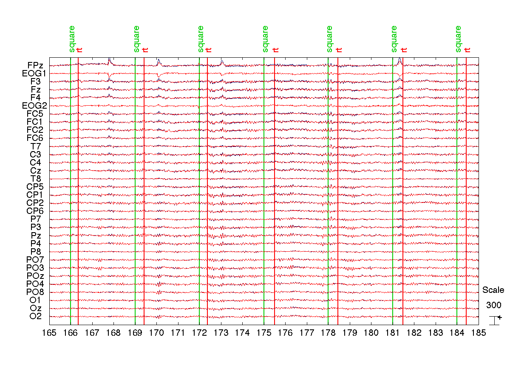
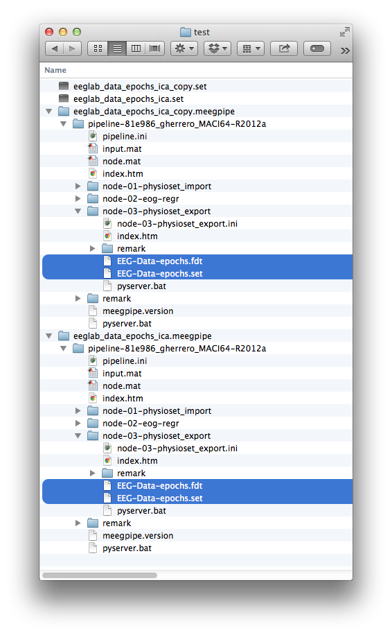

Regressing out ocular artifacts
===

This tutorial illustrates how _meegpipe_ can be used to correct ocular
artifacts using a classical technique: regressing out one or more reference
EOG signals from your EEG data.

## Prerequisites

This tutorial assumes that you have already installed and ininitialized
_meegpipe_. If you haven't done so, then please follow the [installation
instructions](http://germangh.com/meegpipe). For this tutorial you do not need
to install any of the recommended dependencies.

## The sample dataset

For this tutorial we will use the sample (epoched) dataset that comes with
[EEGLAB][eeglab]. You can find it on the `sample_data` directory within
your EEGLAB's installation directory. You can also get it from here:

http://kasku.org/data/meegpipe/eeglab_data_epochs_ica.set

[eeglab]: http://sccn.ucsd.edu/eeglab/


## Least squares regression

The easiest way of regression consists on using the whole EEG dataset to
learn the regression filter weights. Despite its simplicity, this approach
often produces good results.

Before anything else we need to initialize _meegpipe_. You need to do this
only once (for each MATLAB session):

````matlab
% You may consider adding this line to your startup script
meegpipe.initialize
````

Let's create a simple processing pipeline to perform the EOG regression.
The first node in our pipeline needs to take care of reading the
data from the disk file, which is in EEGLAB's `.set` format:

````matlab
myNode1 = meegpipe.node.physioset_import.new(...
    'Importer', physioset.import.eeglab);
````

The second node will perform the actual regression:

````matlab
% Will use a multiple-lag regression filter of order 5 (default is 3)
myNode2 = aar.eog.regression('Order', 5);
````

We can now build a pipeline out of the two nodes above:

````matlab
% We set GenerateReport to false to speed up processing
myPipe = meegpipe.node.pipeline.new(...
    'NodeList',         {myNode1, myNode2}, ...
    'GenerateReport',   false);
````

And finally we can run the processing pipeline on the relevant data file:

````matlab
cleanData = run(myPipe, 'eeglab_data_epochs_ica.set');
````

Let's compare the cleaned and the original data:

````matlab
% The original data
origData = import(physioset.import.eeglab, 'eeglab_data_epochs_ica.set');
plot(origData, cleanData);
````



As you can see, simple regression does minimize the ocular artifacts, but
leaves quite some residuals behind. One reason for this poor performance is
that our regression filter is not able to adapt to intrinsically
non-stationary events such as blinks or saccades.

### Converting the data back to EEGLAB's format

Variable `cleanData` above (as well as variable `origData`) is a
[physioset][physioset] object, the main data structure used by the
_meegpipe_ toolbox. You can convert a _physioset_ object into an EEGLAB
 structure as follows:

[physioset]: ../../+physioset/@physioset/README.md

````matlab
EEG = eeglab(cleanData);
````

Among other ways, you can load `EEG` into EEGLAB using e.g.:

````matlab
eeglab; % Start EEGLAB
[ALLEEG EEG] = eeg_store(ALLEEG, EEG, CURRENTSET);
eeglab redraw;
````

### How does the pipeline know which are the EOG channels?

You may have noticed that we did not specify anywhere which data channels
contain the reference EOG signals. This was not necessary because the labels
of the EOG channels were `EOG1` and `EOG2`, which are automatically
identified by the pipeline as EOG channels (due to the string `EOG` in the
channel label). You can also enforce that channels with certain indices
are used as EOG reference signals:

````matlab
% Channels with indices 2 and 6 contain EOG reference signals
mySel = pset.selector.sensor_idx([2 6]);
myNode2 = aar.eog.regression('Order', 5, 'RegrSelector', mySel);
````


## Adaptive regression

To tackle non-stationarity, we could regress out the EOG reference signals
using an adaptive filter that re-learns the regression weights at each
time instant, using only past data according to a forgetting factor. For
this approach to be computationally feasible one has to learn the
regression weights using adaptive algorithms such as a
[Recursive Least Squares (RLS)][rls]. However, most adaptive filters
(especially RLS-based) can easily become unstable and are hardly suitable
for processing long-duration EEG datasets. There are ways to overcome
these stability problems at the expense of increasing the complexity of the
algorithm [[2]][scrls], but at this point _meegpipe_ does not implement any such
stable adaptive filter (but see [[1]](http://germangh.com/aar)).

[scrls]: http://dx.doi.org/10.1109/78.738242

What `meegpipe` does implement is a way of performing simple least squares
regression in sliding (overlapping) windows. This approach does not have
stability issues and is very effective at removing ocular artifacts. The
obvious downside is that computation time can be considerably longer than
for truly adaptive (e.g. RLS-based) algorithms.

[rls]: http://en.wikipedia.org/wiki/Recursive_least_squares_filter

The following code snippet will regress out the EOG signals from the EEG
channels, in sliding windows of 2 seconds, with 90% overlap between
correlative windows, using a multiple lag regression filter of order 3:

````matlab
myNode1 = meegpipe.node.physioset_import.new(...
    'Importer', physioset.import.eeglab);
myNode2 = aar.eog.adaptive_regression(...
    'Order',          3, ...
    'WindowLength',   2, ...
    'WindowOverlap',  90);
myPipe = meegpipe.node.pipeline.new(...
    'NodeList',         {myNode1, myNode2}, ...
    'GenerateReport',   false);
cleanData = run(myPipe, 'eeglab_data_epochs_ica.set');
````

Let's compare the cleaned and the original data:

````matlab
% The original data
origData = import(physioset.import.eeglab, 'eeglab_data_epochs_ica.set');
plot(origData, cleanData);
````


As expected, sliding-window regression is more effective at removing
ocular activity.

### Exporting to EEGLAB as part of the pipeline

Above we described how you can convert a [physioset][physioset] object back to
an EEGLAB structure using method `eeglab()`. If you are planning to process many
data files and you want to convert all results to EEGLAB format, then you may
find convenient to incorporate the EEGLAB conversion step into the processing
pipeline:

````matlab
myNode3 = meegpipe.node.physioset_export.new('Exporter', physioset.export.eeglab);
myPipe  = meegpipe.node.pipeline.new(...
    'NodeList',         { myNode1, myNode2, myNode3 }, ...
    'GenerateReport',   false);
% Let's create a copy of our sample data file to illustrate how you could
% process multiple files in one go
copyfile('eeglab_data_epochs_ica.set', 'eeglab_data_epochs_ica_copy.set');
fileList = {'eeglab_data_epochs_ica.set', 'eeglab_data_epochs_ica_copy.set'};

% Run the pipeline on all files
run(myPipe, fileList{:});
````

Notice that if [open grid engine][oge] or [Condor][condor] are installed on your
system the two files may be processed in parallel. Whenever you run a pipeline
on a disk file, the results are stored within a directory named as the
input file and ending with the string `.meegpipe`. It should be quite
straightforward to navigate the contents of such `.meegpipe` directories. But
just in case, realize that the full paths to the generated EEGLAB files (in
`.set/.fdt` format) are:

````matlab
% Import utility catfile
import mperl.file.spec.catfile;

% The result of processing eeglab_data_epochs_ica.set
file1 = catfile( ...
    get_full_dir(myPipe, 'eeglab_data_epochs_ica.set'), ...
    'node-03-physioset_export', 'EEG-Data-epochs.set');

% And the result of processing eeglab_data_epochs_ica_copy.set
file2 = catfile( ...
    get_full_dir(myPipe, 'eeglab_data_epochs_ica_copy.set'), ...
    'node-03-physioset_export', 'EEG-Data-epochs.set');

````

Below a snapshot of how my working directory looks like with the exported
EEGLAB files highlighted:




The names of the `pipeline-` directories may differ on your system,
depending on the operating system and MATLAB version that you are running, and
depending also on the version of _meegpipe_ that you are using.


[oge]: http://gridscheduler.sourceforge.net/index.html
[condor]: http://research.cs.wisc.edu/htcondor/

## References

[1] _The Automatic Artifact Removal (AAR) plug-in for EEGLAB_. Available at:
http://germangh.com/aar

[2] Liavas and Regalia, _On the numerical stability and accuracy of the
conventional recursive least squares algorithm_, IEEE Transactions on
Signal Processing, 47 (1), 1999. DOI: [10.1109/78.738242](http://dx.doi.org/10.1109/78.738242)
