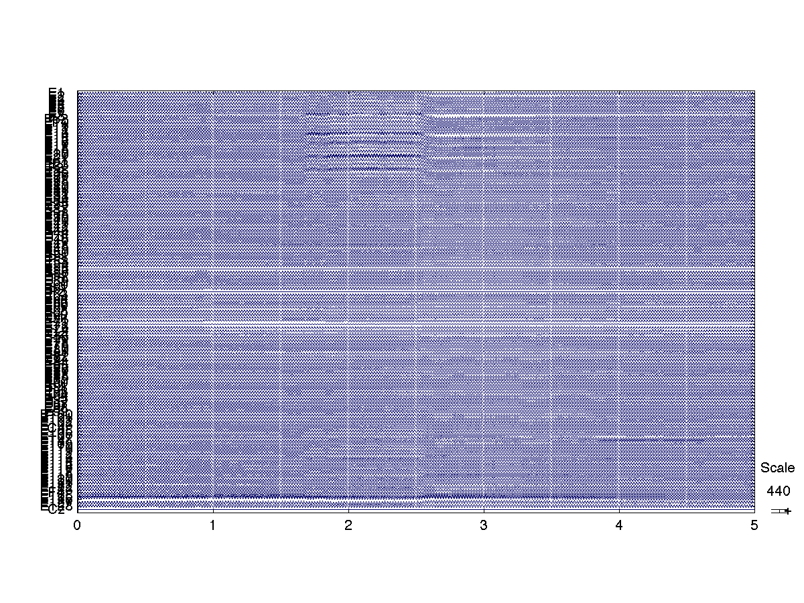
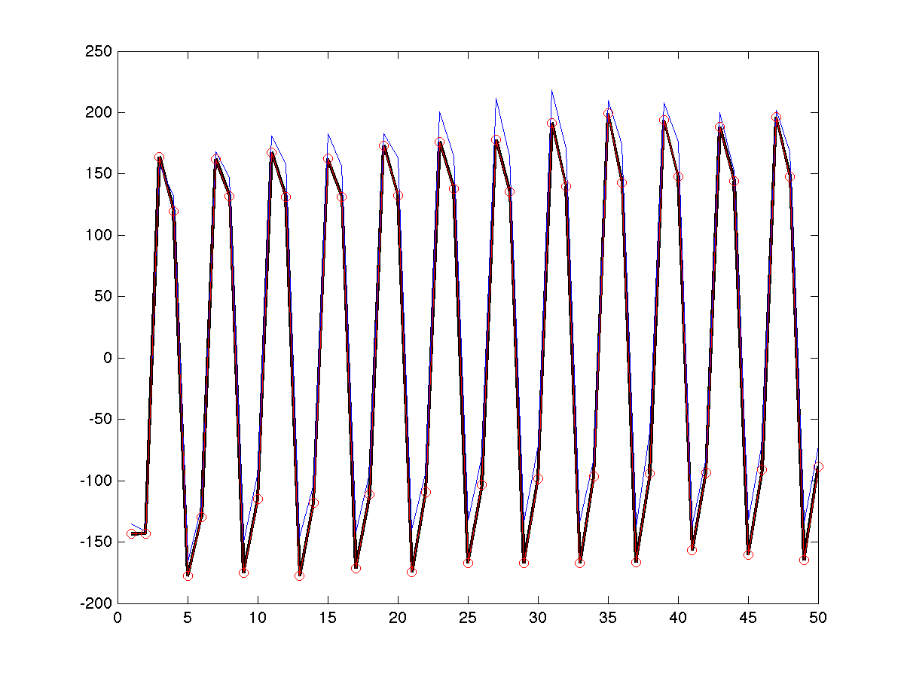
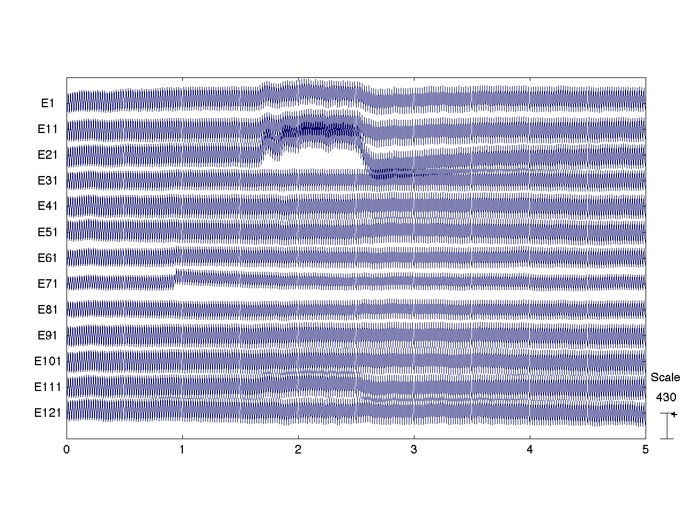
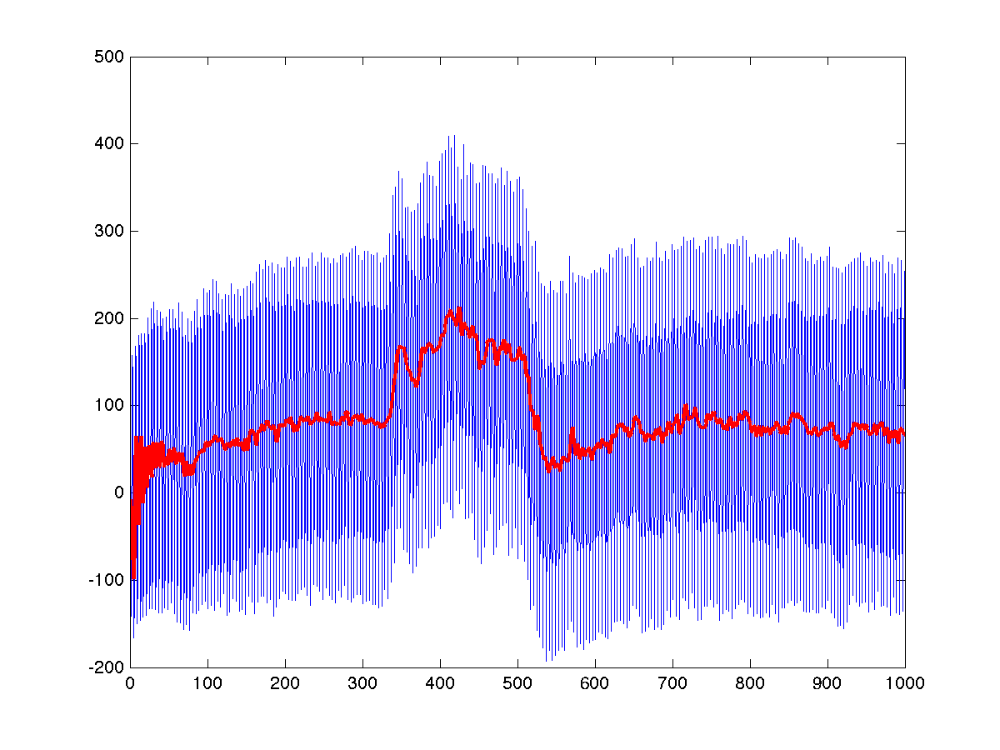

Part 1: working with physiosets
=====

[Go back to the main page of the tutorial](./README.md)

If you are not familiar with Object Oriented (OO) programming concepts like
_class_, _object_ or _interface_, you may want to read some
[background material][oo-concepts] before going any further. You may also
 want to read some documentation on the specifics of 
[MATLAB's OO programming][matlab-oo].

[oo-concepts]: http://docs.oracle.com/javase/tutorial/java/concepts/
[oo-programming]: http://en.wikipedia.org/wiki/Object-oriented_programming
[matlab-oo]: http://www.mathworks.nl/help/matlab/object-oriented-programming.html


## Creating a physioset


### An empty (useless) physioset

You can create an empty [physioset][physioset] object using the 
corresponding [class constructor][constructor]:

[physioset]: ../../+physioset/@physioset/README.md
[constructor]: http://en.wikipedia.org/wiki/Constructor_(object-oriented_programming)

````matlab
myPhysObj = physioset.physioset
````

The `physioset.` is necessary because the _physioset_ class definition is 
contained within the [physioset package][physiosetpkg]. If you don't know
 what a MATLAB package is, please take a look at the 
[documentation][matlabpkg]. An equivalent way to create an empty
 _physioset_ is:

````matlab
% Tell MATLAB that when we write physioset, we mean: physioset.physioset
import physioset.physioset 
myPhysObj = physioset
````

[matlabpkg]: http://www.mathworks.nl/help/matlab/matlab_oop/scoping-classes-with-packages.html
[physiosetpkg]: ../../+physioset

MATLAB will produce the following output after running any of the two code
 snippets above:

````matlab
myPhysObj = 

handle
Package: physioset


                Name : physioset
               Event : []
             Sensors : 0 sensors.dummy; 
        SamplingRate : 250 Hz
             Samples : 0
            Channels : 0
           StartTime : 20-05-2014 13:28:58:230
        Equalization : n/a
           Reference : raw

Meta properties:
````

What you see above is just the result of calling function `disp()` on our 
physioset:

````matlab
% Display (produce a text representation of) a MATLAB vector
myVec = [1 2 3]
disp(myVec)
% Display (produce a text representation of) a physioset object
disp(myPhysObj)
````

It may look from the code above that we are using the same `disp()` 
function to display the contents of a vector and to display (a summary of)
the contents of a physioset. However, this is not correct. When running
`disp(myVec)`, MATLAB's built-in `disp()` function is called:

````matlab
% Show me the contents of MATLAB's built-in disp() function
edit disp
````

On the other hand, running `disp(myPhyObj)` will call method `disp()` for 
the `physioset` class:

````matlab
% Show me the contents of method disp() for class physioset
edit physioset.physioset.disp
````


### A physioset that contains real data

An empty _physioset_ like the one that we built above is useless. For a 
_physioset_ to make any sense it should be based on the contents of a 
experimental recording. The code below will create a physioset based on 
the contents of an EEG recording in EEGLAB's format:

````matlab
% Download and unzip the sample recording (you have done this already!)
unzip('https://dl.dropboxusercontent.com/u/4479286/meegpipe/NBT.S0021.090205.EOR1.zip')

% Create an importer object that knows how to read EEGLAB files
myImporter = physioset.import.eeglab;

% Use method import() of the importer object to create a physioset object 
% based on the contents of the file
myPhysObj = import(myImporter, 'NBT.S0021.090205.EOR1.set')
````

Since we did not terminate with a `;` the last command above, MATLAB will
display the contents of the newly created _physioset_:

````matlab
>> myPhysObj

myPhysObj = 

handle
Package: physioset


                Name : NBT.S0021.090205.EOR1
               Event : []
             Sensors : 129 sensors.eeg; 
        SamplingRate : 200 Hz
             Samples : 60000 (300.0 seconds), 0 bad samples (0.0%)
            Channels : 129, 0 bad channels (0.0%)
           StartTime : 20-05-2014 14:05:44:571
        Equalization : no
           Reference : raw

Meta properties:

    eeglab: [1x1 struct]

````

You may have noticed that when the _physioset_ object `myPhysObj` was 
created, a file called `NBT.S0021.090205.EOR1.pset` was created in your 
current working directory. It is in that file where the EEG data values 
are actually stored and not in the `myPhysObj` variable that you have 
in your MATLAB workspace and that is intended to hold only meta-data such 
as sensor information and events. Indeed, `myPhysObj` occuppies only 
112 bytes in MATLAB's working memory, which is far too little to contain
60000 samples of 128 EEG channels:

````matlab
>> whos
  Name              Size               Bytes  Class                      Attributes
                              
  myImporter        1x1                  311  physioset.import.eeglab              
  myPhysObj       129x60000              112  physioset.physioset                  

````

Whenever you create a _physioset_ object, a corresponding `pset` file will 
be created to hold the values of the time-series contained in the 
_physioset_. In this way, _meegpipe_ can handle very large data files 
without running into memory problems, provided of course that you have 
enough disk space. You can find out what disk file corresponds to a given
dataset using method `get_datafile()`:

````matlab
get_datafile(myPhysObj)

ans =

C:\workdir\NBT.S0021.090205.EOR1.pset
````

## Accessing physioset data

Our _physioset_ object `myPhysObj` gives as access to the EEG time-series 
and all related meta-data (events, sensors information, etc). You can 
access the EEG data values in the same way as you would access elements in 
a MATLAB matrix. For instance, you can get the 5 first values of channel 
number 15 as follows:

````matlab
eegValues = myPhysObj(15, 1:5)
````

The code above will create a MATLAB vector with 5 elements called 
`eegValues` and will display its contents:

````matlab
eegValues =

 -162.4577 -184.7542  120.4011   77.2734 -213.7123
````

Meta-data on sensors, events, etc. can also be accessed and modified using 
appropriate methods. For more information, see the 
[documentation][physioset-api].

[physioset-api]: ../../+physioset/README.md


## Understanding physiosets


### Aliases

The following code snippet illustrates a crucial characteristic of 
_physioset_ objects that can be quite counterintuitive at first:

````matlab
% myPhysObj contains our EEG data
% Let's make sure that the first data channel is not filled with zeros
assert(~all(myPhysObj(1,:) == 0));

% Now let's make a copy of our physioset:
myPhysObjCopy = myPhysObj;

% Lets's set to zeros the first channel of the copied physioset
myPhysObjCopy(1,:) = 0;
assert(all(myPhysObjCopy(1,:) == 0));

% This may be surprising ...
assert(all(myPhysObj(1,:) == 0));
````

Conclusion: `myPhysObj` and `myPhysObj2` are just _aliases_ of the 
same underlying physioset. This is contrary to the behavior of 
the `=` asignment operator for MATLAB's built-in types, which indeed
 creates two independent copies of the same underlying data. If you really
need to create two independent copies of a _physioset_ then you must be
explicit about your intentions:

````matlab
% myPhysObj contains our EEG data
% Let's make sure that the first data channel is not filled with zeros
assert(~all(myPhysObj(1,:) == 0));

% Now let's make a REAL copy of our physioset:
myPhysObjCopy = copy(myPhysObj);

% Lets's set to zeros the first channel of the copied physioset
myPhysObjCopy(1,:) = 0;
assert(all(myPhysObjCopy(1,:) == 0));

% This assertion will now fail
assert(all(myPhysObj(1,:) == 0));
````

If you run the code snippet above line by line you will notice that 
command `myPhysObjCopy = copy(myPhysObj)` informs you that the disk file 
that holds the _physioset_ data values is being copied. Indeed, your
 current directory should now contain two `.pset` files like (the 
second file name will differ in your case):

````
NBT.S0021.090205.EOR1.pset
session_1\20140520T152506_a26da.pset
````

You may have also noticed a message saying that a new session (_session1_) 
has been created. Command `myPhysObjCopy = copy(myPhysObj)` requires the
 creation of a new _physioset_ object and thus _meegpipe_ needs 
to produce a suitable name for the corresponding disk file.  
In the absence of more information, _meegpipe_ decides to use a 
semi-random name and place it under a directory called `session_1`. In this
 way you can easily identify files that are produced by meegpipe and that
you may want to remove when you are done with your exploratory analysis. 


### physioset files are temporary (by default)

By default the disk file associated with a _physioset_ object will exist 
only for as long as there is at least one alias of that _physioset_ in 
the MATLAB workspace. See: 

````matlab
clear all;
````

The command above will not only clear your MATLAB workspace but will also
delete all the `.pset` files that were created as a result of our 
experiments above. That is, both your current directory and the `session_1`
and `session_2` directories should now be empty. Let's see how this works
in more detail:

````matlab
% Let's create a random physioset
obj = import(physioset.import.matrix, rand(2,1000));

% Let's create an alias
obj2 = obj;

% Realize that both obj2 and obj are aliases of the same physioset
assert(strcmp(get_datafile(obj), get_datafile(obj2)));

% Let's delete one of the aliases 
clear obj;

% Notice that the .pset file has not been deleted
dataFile = get_datafile(obj2);
assert(exist(dataFile, 'file') > 0);

% Let's delete the second alias
clear obj2;

% Now the associated .pset file is automatically deleted because there 
% are no remaining references to it in MATLAB's workspace
assert(~exist(dataFile, 'file'));
````


### Storing and retrieving physiosets

Let's import again the sample EEG dataset:

````matlab
% Start with a clean workspace
clear all;

% Import the sample EEG dataset
data = import(physioset.import.eeglab, 'NBT.S0021.090205.EOR1.set');
````

Let's perform a simple modification, such as zeroing out the first data 
channel:

````matlab
data(1,:) = 0;
````

If we would now clear the MATLAB workspace (or if we would quit MATLAB), 
the disk file associated with `data` (file `NBT.S0021.090205.EOR1.pset`)
 would be automatically deleted and therefore our modified _physioset_
object would be lost forever. We can prevent that by _saving_ the 
_physioset_ using the `save()` method:

````matlab
save(data);
````

A side effect of the command above is the creation of a `.pseth` file so 
that your current working directory now looks like this:

````
NBT.S0021.090205.EOR1.set
NBT.S0021.090205.EOR1.fdt
NBT.S0021.090205.EOR1.pset
NBT.S0021.090205.EOR1.pseth
````

That `.pseth` file is used to stored the meta-data associated with your 
_physioset_. As you already know, the `.pset` file stores the EEG 
measurements. After saving our _physioset_ using `save()` we can safely
clear our MATLAB workspace:

````matlab
clear all;
````

Then we can retrieve at any time our modified _physioset_ using the 
`pset.load` function:

````matlab
% We need to load only the .pseth file. Not the .pset!
retrievedData = pset.load('NBT.S0021.090205.EOR1.pseth');

assert(all(retrievedData(1,:)==0));
````

Before continuing to the next section, let's remove the `.pset/.pseth` 
files that we have just created for illustration purposes:

````matlab
clear all;
delete('NBT.S0021.090205.EOR1.pseth');
delete('NBT.S0021.090205.EOR1.pset');
````


## A simple visualization: `plot()`

Let's import once again the sample EEG dataset:

````matlab
data = import(physioset.import.eeglab, 'NBT.S0021.090205.EOR1.set')
````

The summary information produced by the command above shows that we are
dealing with a physiological dataset consisting of 129 EEG channels, 
sampled at 200 Hz. In total, there are 300 seconds of data (60000 samples).
The first thing you will typically want to do with any dataset is to take a
look at the EEG time-series:

````
plot(data)
````

Don't be deceived, the command above does not call MATLAB's builtin `plot()`
function, which doesn't know how to plot _physioset_ objects. Instead MATLAB
realizes that `data` is a _physioset_ object and thus it first looks for a 
a method named `plot()` defined for objects of class _physioset_. Indeed  
the _physioset_ class implementation includes such a method and therefore
MATLAB finds it, and calls it.  You can inspect the code of method `plot()`
by typing `edit physioset.physioset.plot` in your MATLAB command window. 

The call to method `plot()` produces a figure that allows you scroll 
through your dataset:



If you are a user of [EEGLAB][eeglab] you may have realized that method 
`plot()` for _physioset_ objects is just a wrapper around EEGLAB's 
[eegplot][eegplot] function. An obvious problem with this visualization is
that we are plotting too many channels and this results in a very poor 
level of detail for each time-series. A more subtle problem is that, in
 order to make the visualization faster, method `plot()` loads all 
_physioset_ data values in MATLAB's workspace before calling EEGLAB's
`eegplot()`. This means that if you try to plot a very large dataset (e.g. 
an 8 hours long hdEEG sleep recording) you will just get an out-of-memory
error. The solution is to use _data selections_.

## Data selections

The _physioset_ class defines a very useful method, called `select()` that 
allows you to define the subset of your data that should be visible 
to anybody using a _physioset_ object. To illustrate how this works, let's
start by plotting a bit of data from channels 1 and 5. Notice that
`data(5, 1:50)` reads 50 samples from the _physioset_ and produces a MATLAB
vector. Thus MATLAB's builtin plot() function is called in the snippet 
below:

````matlab
close all;
plot(data(5, 1:50), 'k', 'LineWidth', 2);
hold on;
plot(data(1, 1:50));
````

Clearly, channel 1 and 5 are not identical. Though they are very similar 
for both are heavily contaminated with the same source of powerline noise. 
Before calling method `select()` let's recall the dimensions of our 
`physioset` using method `size()`:

````matlab
size(data)
````

As expected, MATLAB tells us that we have 129 channels and 60000 samples:

````matlab
>> size(data)

ans =

         129       60000
````

Let's now _select_ channels 5 to 10 and samples 1 to 1000:

`````matlab
select(data, 5:10, 1:1000);
````

And now let's inspect again the dimensions of our _physioset_ using 
`size(data)`:

````
>> size(data)

data

ans =

           6        1000
````

The new dimensions are consistent with the selection that we just made. 
Indeed the following code demonstrates that, after the selection, 
`data(1, 1:50)` is equivalent to `data(5, 1:50)` before the selection:

````matlab
% Hopefully you did not close the figure that plotted
% data(1,1:50) and data(5,1:50)
hold on;
plot(data(1,1:50), 'ro-');
````



Data outside the selection is not anymore accessible. If you try to access
`data(1, 1001)` or `data(7, 1)` you will just get an error indicating that
you are exceeding the dimensions of your _physioset_. 

It is very important to realize that data selections __never__ lead to 
data loss. Data selections do not modify at all the data values 
stored in a _physioset_ object. Instead, selections simply re-define how
indices `i,j` are interpreted when calling `data(i,j)`. Obviously, this 
means that data selections can be cascaded, and undone:

````matlab
% Lets create a toy physioset for illustration purposes
toy = import(physioset.import.matrix, zeros(3, 1000));
toy(1,:) = 1;
toy(2,:) = 2;
toy(3,:) = 3;

% Let's select channels 2 to 3, resulting in a 2x1000 physioset
select(toy, 2:3);
assert(all(toy(1,:) == 2));

% Let's cascade another selection
select(toy, 2);
assert(all(size(toy) == [1 1000]));
assert(all(toy(1,:) == 3));

% Let's undo (only) the last selection
restore_selection(toy);
assert(all(size(toy) == [2, 1000]));
assert(all(toy(1,:) == 2));

% Let's re-select
select(toy, 2);
assert(all(size(toy) == [1, 1000]));
assert(all(toy(1,:) == 3));

% Let's clear all selections at once
clear_selection(toy);
assert(all(size(toy) == [3, 1000]));
assert(all(toy(1,:) == 1));
````

Now that we can understand how data selections work, we can use them 
in combination with `plot()` to plot (and load into MATLAB's memory) only 
the subset of the data we want to take a look at:

````matlab
% Let's plot only 1 every 10 channels
select(data, 1:10:129);
plot(data);
````




## Mathematical operators

The _physioset_ class implements custom versions of many mathematical 
operators that allow you to apply such these operators on datasets of
 virtually any size. For instance, the two commands below produce the 
same result but only the second command could be used with very large 
datasets:

````matlab
% Let's select only the first two channels to make the covariance matrices
% smaller and easier to visualize
select(data, 1:2);

% Compute the data covariance using MATLAB's built-in cov
% This is fast, but impossible to do with very large datasets
tic;cov(data(:,:)');toc

% Let's now compute the covariance using method cov() from class physioset
% This is slower, but will work no matter how big data is
tic;cov(data);toc
````

What is the difference? the custom-made `cov()` defined on objects of 
class _physioset_ computes the covariance matrix incrementally in 
sliding windows, without ever attempting to load too much data at once 
into MATLAB's workspace.

Another typical example is re-referencing, which can be always implemented
as matrix multiplication. For instance, for our 2-dimensional dataset 
(considering the data selection performed above), you could re-reference 
to the average signal as follows:

````matlab
% The re-referencing matrix
R = [0.5 -0.5;-0.5 0.5];

% Let's load all our data into MATLAB's workspace
X = data(:,:);

% Let's re-reference
Xr = R*X;

% We could now store the result back in the physioset using:
% data(:,:) = X;
% But don't do this yet!
````

The problem with the approach above is that if `data` is very large, we 
will not be able to load all data into the workspace at once using
`X = data(:,:)`. On the other hand, the following approach will
work no matter how big `data` is:

````matlab
% The re-referencing matrix
R = [0.5 -0.5;-0.5 0.5];

% Notice that I don't write data = R*data (but I could have, with exactly
% the same effect). I explain this later...
R*data;

% Let's check whether it worked by comparing with the result of the first 
% approach:
assert(all(all(data(:,:) == Xr)));
````

The example above illustrates another very important characteristic of 
_physiosets_. If possible (and if it makes sense) all operators are 
applied in-place, i.e. command `R*data` means: left-multiply all the data
values stored in `get_datafile(data)` with matrix `R`. This is usually the
desired behavior because, if you want to re-reference a 20 GB _physioset_ 
you want to make a copy of the underlying disk file __only if it is 
really necessary__. In some cases you may want to avoid this default 
behavior and prevent any modification of your original _physioset_. In that
case you should explicitly create a copy:

````matlab
data = import(physioset.import.eeglab, 'NBT.S0021.090205.EOR1.set');
select(data, 1:2);

% Create an explicit copy
dataReref = R*copy(data);

% Equivalently we could have done instead:
% dataReref = copy(data); R*dataReref;
````

The code above will result in two physiosets: One with the original 
data reference (`data`, attached to disk file `get_datafile(data)`), and
another one average-referenced (`dataReref`, attached to disk file 
`get_datafile(dataReref)`). 


## Data processing: filtering

Processing procedures beyond simple mathematical operators are typically
implemented as separate _data processing classes_, and not as methods of
the _physioset_ class. The code snippet below demonstrates the application
of a low pass filter to the sample _physioset_:

````matlab
% Create a low-pass filter object with a cutoff of 40 Hz
myFilter = filter.lpfilt('fc', 40/(data.SamplingRate/2));

% Plot the data before filtering
figure;plot(data(1, 1000:1200));

% Apply the filter to the physioset. Note that filter() is a method of 
% class filter.lpfilt, and not of class physioset!
filter(myFilter, data);

% Before/after filtering
hold on;plot(data(1, 1000:1200), 'r', 'LineWidth', 2);
````




