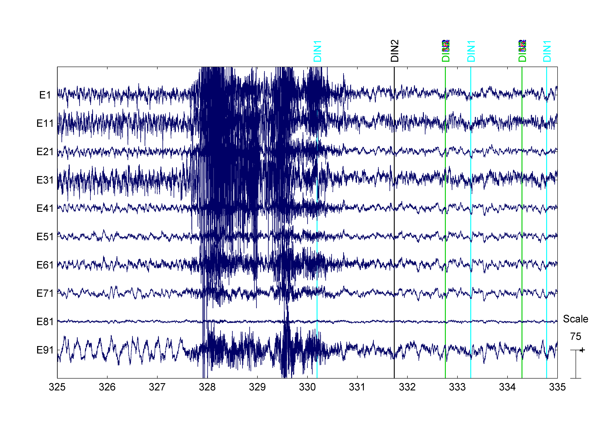
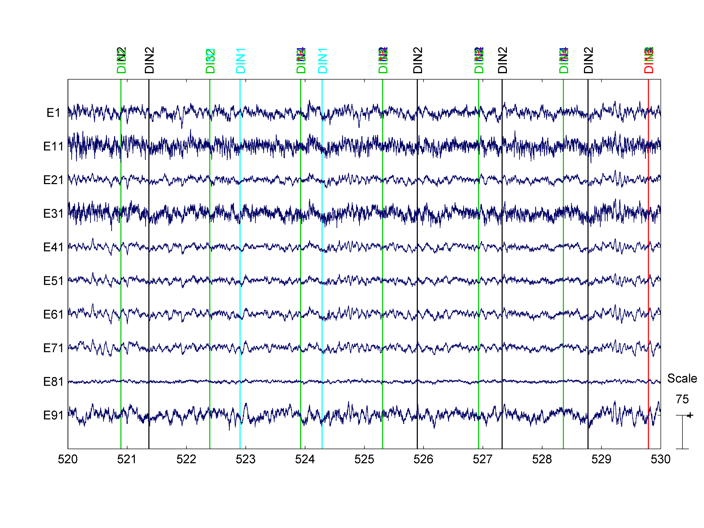
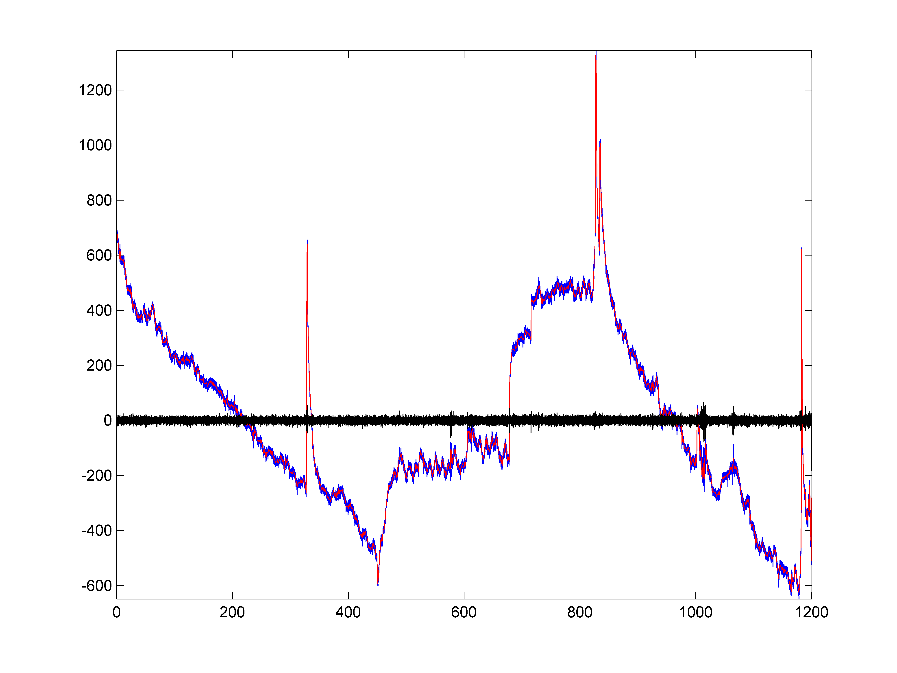

Tutorial: cleaning tDCS-EEG data
========


__NOTE:__ This tutorial is under preparation.

In this tutorial we will use a [1D Adaptive-scale filter][lasip] to 
remove tDCS artifacts from simultaneous tDCS-EEG recordings. 

[lasip]: http://www.cs.tut.fi/~lasip/


## Defining the cleaning pipeline


````matlab
eval(meegpipe.alias_import('nodes'));
import physioset.import.mff;
import report.plotter.io;
import pset.selector.sensor_class;
import meegpipe.node.bss_regr.*;
import spt.pca.pca;

myFilter = filter.lasip('Q', 20, 'Gamma', 3:0.1:5);

myPipe = pipeline('NodeList', ...
    {...
    physioset_import('Importer', mff), ...
    center, ...
    tfilter('Filter', myFilter, 'ReturnResiduals', true), ...
    }, ...
    'Name',             'tDCS-EEG pipeline', ...
    'Save',             true, ...
    'GenerateReport',   false);
````

## Processing the data files

````matlab
meegpipe.initialize; % Needed only once per MATLAB session
import misc.dir;
import mperl.file.spec.catfile;

% I assume that the tDCS files are .mff files within the current directory
% and that all file names end with the string: TDCS
myFiles = catfile(pwd, dir(pwd, 'TDCS.mff$'));
cleanData = run(myPipe, myFiles);
````

Below you can see two different snapshots of the cleaned data. The first 
snapshot corresponds to the location of one of the sharp EEG spike caused
by the tDCS pulse ramp up. As you can see there is some residual noise left
at the original location of the spike. The second snapshot corresponds to
a time epoch that contained large (relative to the neural EEG) tDCS
artifacts. However, such artifacts have been almost completely removed
by the [1D Adaptive-scale filter][lasip].







The tDCS artifact is so large that there is no point in comparing the raw 
data with the processed snapshot above. To get an idea of what the LASIP
filter did see the single channel plot below where the original data
(blue line) is plotted together with the processed data (black line). The 
red line plots the difference between original and clean data. The latter 
should be as close as possible to the shape of the tDCS artifact.


